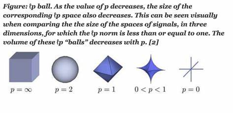

- [第一次组会的笔记](#第一次组会的笔记)
  - [Lipschitz约束](#lipschitz约束)
    - [范数(向量范数)](#范数向量范数)

# 第一次组会的笔记

## Lipschitz约束

👉 若一个模型对输入扰动不敏感，该模型的泛化能力越好

$$
\mid \mid f_w(x_1) - f_w(x_2) \mid \mid \leq C(w) \cdot \mid \mid x_1-x_2 \mid\mid
$$

- $C(w)$只与模型的参数有关，与输入无关
- 要使$C(w)$尽可能小

### 范数(向量范数)

👉 定义(p范数)

$$
\mid \mid x \mid \mid = (\sum_{i=1}^{n} \mid x\mid_i^p)^{\frac{1}{p}}
$$

- $x_i$表示$x$的第$i$个分量
- 0范数
  - $x$中非零元素的个数 若范数越小，0元素越多，则越稀疏
    - 越稀疏越能降低模型的复杂度
  - 求解是NP-Hard问题
    - 通常采用1范数
- 1范数
  - $\mid \mid x \mid \mid =\sum_{i=1}^{n} \mid x\mid_i$
- 2范数
  - $\mid \mid x \mid \mid = \sqrt{\sum_{i=1}^{n} \mid x\mid_i^2}$
- 无穷范数
  - $\mid \mid x \mid \mid = max \mid x_i \mid$

👉 范数球(单位球)

$$
\Beta = \{x\in \R^n \mid \quad \mid \mid x \mid \mid \leq 1\}
$$

谱范数

损失函数一阶泰勒展开

损失函数的landscape更平滑

损失函数BP推导

特征 鲁棒 非鲁棒

FGSM迁移性较好 PGD随着迭代次数上升 迁移性下降

自适应PGD 早停止迭代 优化决策面

Flooding 损失函数优化到一个阈值附近