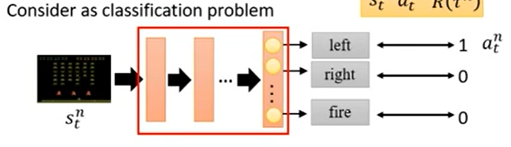
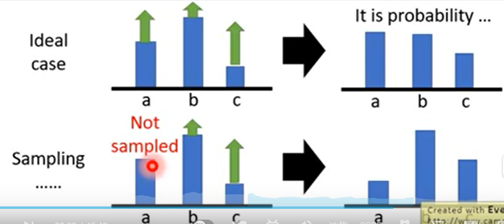

- [Reinforcement Learning 李宏毅](#reinforcement-learning-%e6%9d%8e%e5%ae%8f%e6%af%85)
  - [Policy Gradient](#policy-gradient)
    - [Basic Components](#basic-components)
    - [Goal](#goal)
    - [Policy Gradient Part](#policy-gradient-part)
    - [Implementation](#implementation)
  - [Proximal Policy Optimization(PPO)](#proximal-policy-optimizationppo)
    - [On-policy to Off-policy](#on-policy-to-off-policy)
    - [Importance Sampling](#importance-sampling)
    - [Implement Off-policy](#implement-off-policy)
    - [PPO](#ppo)
  - [Q-Learning](#q-learning)
    - [State-Value Function](#state-value-function)
    - [State-Action Value Funtion——Q Function $\,Q^\pi (s,a)\,$](#state-action-value-funtionq-function-mathsemanticsmrowmtext-mtextmsupmiqmimi%cf%80mimsupmo-stretchy%22false%22momismimo-separator%22true%22momiamimo-stretchy%22false%22momtext-mtextmrowannotation-encoding%22applicationx-tex%22qpi-saannotationsemanticsmathq%cf%80sa)
    - [Tricks](#tricks)
    - [Q-Learning Algorithm](#q-learning-algorithm)

# Reinforcement Learning 李宏毅

## Policy Gradient

### Basic Components

👉 Agent——需要make policy

👉 环境和Reward Function——都是已经设定好的，不能修改

👉 Policy(通常用$\,\pi\,$表示)是一个含参$\,\theta\,$的网络

👉 Policy的输入通常是**机器的画面(如游戏某时刻的画面)**，输入是用矩阵的形式输入(将画面抽象为像素)

👉 Policy的输出是**执行某一动作的概率**，Agent会根据这个概率来做出对应的Action

We define some symbols:

某一状态(对于游戏来说是画面)$\,\rightarrow\, s_i$

reward $\,\rightarrow r_i\,$

action $\,\rightarrow a_i\,$

### Goal

👉$\,R = \sum_{i=1}^T r_i\,$，目标是通过调整Policy的参数$\,\theta\,$使$\,R\,$最大化

👉每一场游戏都有一个**trajectory**
$$
    \tau = \{ s_1,a_1,s_2,a_2,\cdots,s_T,a_T \}
$$
👉某一轨迹出现的概率计算如下
$$
    \begin{aligned} &
        p_\theta(\tau)\\ &
        =p(s_1)p_\theta(a_1 \mid s_1)p_(s_2\mid s_1,a_1)p_\theta(a_2\mid s_2)p(s_3|s_2,a_2)\cdots \\ &
        =p(s_1)\prod_{t=1}^T p_\theta(a_t\mid s_t)p(s_{t+1}\mid s_t,a_t)
    \end{aligned}
$$
要注意到$\,R\,$是一个随机变量，因为$\,s_i,a_i\,$具有随机性。若要最大化$\,R\,$，则要最大化$\,R\,$的期望

👉下面是计算$\,R\,$的期望的梯度(有最大似然估计的思想)
$$
    \begin{aligned} &
        \nabla \,\,\overline{R_\theta} \\
        &= \sum_\tau R(\tau)\nabla p_\theta(\tau) \\
        & =\sum_\tau R(\tau) p_\theta(\tau) \frac{\nabla p_\theta(\tau)}{p_\theta(\tau)} \\
        &= \sum_\tau R(\tau) p_\theta(\tau)  \nabla \log p_\theta(\tau) \\
        &= E_{\tau \sim p_\theta(\tau)} [R(\tau)\nabla\log p_\theta(\tau)] \\
        &\approx \frac{1}{N} \sum_{n=1}^N R(\tau^n)\nabla\log p_\theta(\tau^n) \,\,\text{note that n is index and we need to use sampling to compute} \\
        &= \frac{1}{N} \sum_{n=1}^N \sum_{t=1}^{T_n} R(\tau^n)\nabla
        \log p_\theta(a_t^n \mid s_t^n) \\
        &\text{In the last formula,note that in formula} \,p_\theta(\tau) \text{we cannot control} \,p(s_1) \text{because it's based on the Env so we only need to "gradient" the part with} \,\theta
    \end{aligned}
$$
即要优化的$\,R\,$的期望为(很像最大似然估计，$\,p_\theta\,$像概率密度函数)
$$
    \frac{1}{N} \sum_{n=1}^N \sum_{t=1}^{T_n} R(\tau^n)
        \log p_\theta(a_t^n \mid s_t^n)
$$

**i.e** There is a formula for the above demonstration:
$$
    \nabla f(x) = f(x) \nabla \log f(x)
$$

### Policy Gradient Part

训练好的Agent，进行数据的采集，带入公式计算之后调整参数得到新的模型，再次进行数据采集，不断调参

👉感觉sample要花好久，而且update一次就不能用了

### Implementation

👉考虑为一个**分类(classification)** 的问题

input是某一state$\,s_t^n,$的界面，output是这个state下对应的action$\,a_t^n\,$,为了优化
$$
    \frac{1}{N} \sum_{n=1}^N \sum_{t=1}^{T_n} R(\tau^n)
        \log p_\theta(a_t^n \mid s_t^n)
$$
即告诉agent当遇到同样的state$\,s_t^n,$时，输出对应的action$\,a_t^n\,$，对应到公式上即为求梯度,即拉高遇到state$\,s_t^n,$时，输出action$\,a_t^n\,$的概率。但注意，reward是**整场游戏的reward**
$$
    \frac{1}{N} \sum_{n=1}^N \sum_{t=1}^{T_n} R(\tau^n)\nabla
        \log p_\theta(a_t^n \mid s_t^n)
$$

但是在Implement时会遇到问题，如下图所示

一般来说reward都是正的，假设在state$\,s_t^n,$可以执行三个action——a,b,c。所以执行a,b,c的概率都会增加，但是不同的action的reward不同，所以经过normalization之后，reward小的，如图中的b的概率就会下降

但是在**Sampling**时由于数据不能覆盖的全部的可能，可能会出现如action a没有被sampling到，但不能说明action a的reward就很小，但因为没有sampling到，action b和c的概率就会增大，action a的概率就会减小，这样就出现了问题

👉所以要设置一个**baseline**，当一个action的reward很小的时候，要降低执行此action的概率，引入
$$
    b \approx E[R(\tau)]
$$
所以$\,\nabla \overline{R_\theta}\,$的公式要改写为
$$
    \nabla \overline{R_\theta} \approx
    \frac{1}{N} \sum_{n=1}^N \sum_{t=1}^{T_n} (R(\tau^n)-b)\nabla
        \log p_\theta(a_t^n \mid s_t^n)
$$

此外，每一个state都要乘上同样的reward$\,(R(\tau^n)-b)\,$,这样其实是不公平的，每一个state乘上的reward应该是这个state之后(包括这个state)产生的reward之和，但两个state之间的时间间隔越长，后面的state的reward对该state的影响就会越小，因此还需要乘上一个discount，所以$\,R(\tau^n)\,$应该变为下式
$$
    \sum_{t^{'}}^{T_n} \gamma^{t'-t} r_{t'} ^n, \,\, \gamma < 1
$$
将
$$
    \sum_{t^{'}}^{T_n} \gamma^{t'-t} r_{t'} ^n -b
$$
称为Advantage Function $\,A^\theta(s_t,a_t)\,$,它能够表现出在state$\,s_t\,$，action$\,a_t\,$相较于其他的action有多好，因为减去了一个b，所以它是一个相对值

综上
$$
    \nabla \overline{R_\theta} \approx \frac{1}{N} \sum_{n=1}^N \sum_{t=1}^{T_n} A^\theta(s_t,a_t)\nabla
        \log p_\theta(a_t^n \mid s_t^n)
$$

## Proximal Policy Optimization(PPO)

👉 Proximal: 近端的

### On-policy to Off-policy

👉 On-policy: Agent一边与环境互动一边学习

👉 Off-policy: Agent看着别人与环境互动学习

👉 之前的Policy Gradient属于On-Policy，效率太低，sample的很多数据在进行一次model update之后就不能用了，要重新sample。

👉 Off-policy的目标就是有一个新的policy$\,\theta^{'}\,$与环境做互动，收集的数据来训练policy$\,\theta\,$,这样可以将$\,\theta^{'}\,$收集的数据使用很多次

### Importance Sampling

👉 IS是一个general的idea，不止可以用于RL

👉 从一个分布的期望到另一个分布的期望
$$
    若f(x)不可积，可以用下面的sampling的方法计算在x\sim p(x)时f(x)的期望\\
    E_{x\sim p} (f(x)) \approx \frac{1}{N}\sum_{i=1}^{N} f(x^i)
$$
但若无法从p(x)中sample$\,x^i\,$,而只能从另一个分布q(x)中sample，可以采取下面的变换
$$
    E_{x\sim p} (f(x)) = \int f(x)p(x)dx = \int f(x)\frac{p(x)}{q(x)} q(x)dx = E_{x\sim q} [f(x)\frac{p(x)}{q(x)}] \\
    \frac{p(x)}{q(x)}可以看作通过q(x)来计算f(x)对于p(x)期望的修正或权重
$$

👉 但是这个权重不能相差过大

具体的数学推导如下图所示

形象的描述如下图所示

p(x)在f(x)<0的部分的概率很大，所以等式左侧的值是negative的

但是对于q(x)则相反，这样会使等式右侧的值是positive的，但是如果**sample的次数够多**，能够sample到f(x)<0的部分，这是$\,\frac{p(x)}{q(x)}\,$的值是很大的，f(x)就会乘上一个很大的权重(可以认为是一个很大的负数，可以抵消sample到f(x)>0时的影响)，所以此时才可能使等式成立

### Implement Off-policy

$$
    \nabla \,\,\overline{R_\theta} = E_{\tau \sim p_\theta(\tau)} [R(\tau)\nabla\log p_\theta(\tau)] \Rightarrow \nabla \,\,\overline{R_\theta} = E_{\tau \sim p_{\theta^{'}}(\tau)}[\frac{p_\theta(\tau)}{p_{\theta^{'}}(\tau)} R(\tau)\nabla\log p_\theta(\tau)]
$$
引入上文中$\,A^\theta(s_t,a_t)\,$，gradient可改写为下图中的式子

👉其中$\,A^\theta(s_t,a_t)\,$要变为$\,A^{\theta^{'}}(s_t,a_t)\,$，因为与环境交互的对象发生了变化

👉backslash去掉的那一项的值可以看作为1(两个agent看到同一个画面的概率时一样的，或按视频所说——没法算)

👉最终得到的formula是取gradient之前的objective function(即要optimize的function)

### PPO

👉 PPO要做的事情就是避免$\,\theta,\theta^{'}\,$差的太大，要不然IS的结果会不好 

👉 加入了计算$\,\theta,\theta^{'}\,$KL散度的罚项，但这里KL散度计算的不是两个参数的距离，而是对于某个state，两个actor(参数分别为$\,\theta,\theta_{'}\,$)输出的action的距离，然后对于所有state求和(应该是求和吧，视频里没说)

👉下面公式中第一个case，说明KL散度项起的作用小，第二个case说明KL散度起的作用过大，使$\,\theta ,\theta^k\,$几乎一样了

$$
    if KL(\theta ,\theta^k) > KL_{max}, increase \beta\\
    else \quad decrease \beta
$$
👉 下面是PPO的第二种算法
$$
    clip函数是指若权重 < 1- \varepsilon , 则该函数取值为 1- \varepsilon \\
    若权重 > 1+ \varepsilon ,该函数取值为 1 + \varepsilon
$$
👉若以权重为横轴，clip函数的值为纵轴，函数图像如下图所示

前面一项是一条过原点的直线，之后这一项与后面的clip取最小值

👉如果A>0,说明要提高$\,p_\theta\,$的概率，但是提高$\,p_\theta\,$会导致它和$\,p_{\theta^k}\,$的差距变大，这样不符合PPO的出发点，因此此时最大不能超过$\,1+\varepsilon\,$，如下图所示，是红色的线 

👉如果A<0,与上文刚好相反，但是最小不能小过$\,1-\varepsilon\,$,如下图所示，是红色的线 

## Q-Learning

### State-Value Function

👉判断一个actor的好坏，output value of a critic取决于critic所评价的actor

👉 State value function $\,V^{\pi} (s)\,$ (即根据输入的state输出value) 

$\,V^\pi\,$是一个网络，给定一个state之后，会输出使用actor$\,\pi\,$，在state s之后所能得到的所有的reward之和

👉 estimate $\,V^{\pi} (s)\,$ via Monte-Carlo(MC) based approach

搜集大量的state，训练network，使当看到某一个state假设为$\,s_a\,$的时候，输出之后的reward求和$\,V^\pi (s_a)\,$，使输出的值与**游戏结束时得到的reward$\,G_a\,$是十分接近**，可以看作是回归

问题是：要采集大量的数据来训练network，而且每盘游戏结束后才能得到真实的reward,但有的游戏时间很长，若要游戏结束，很难采集到很多数据。于是引出下面的方法

👉 estimate $\,V^{\pi} (s)\,$ via Temporal-difference(TD) based approach(时间差分算法)
$$
    对于某个trajectory\quad \cdots,s_t,a_t,r_t,s_{t+1}\cdots \\
    希望train之后的network满足 V^\pi (s_t) = V^\pi (s_{t+1}) + r_t
$$
所以就收集数据，进行差分操作，计算和$\,r_t\,$的距离，就是一个拟合的问题。

👉 Comparsion between MC and TD

Ex.

其中对于$\,V^\pi (s_a)\,$的值出现了不同

因为对于第一个episode,使用MC会认为$\,s_a influences s_b\,$,而TD会认为只是一个巧合(二者可以认为是独立的)

### State-Action Value Funtion——Q Function $\,Q^\pi (s,a)\,$

actor$\,\pi\,$在state $\,a\,$,**强制使用action** $\,a\,$,这个state之后得到的所有的reward总和

**Att！！！！**：在state $\,a\,$，actor不一定会执行action $\,a\,$，这里是让actor强制执行action $\,a\,$

对于下图，左边是通用的一种表示形式，右边只有action是可以穷举的时候才可以这样表示

👉 Implement Q-Learning

先初始化一个actor，计算这个actor的Q function，计算的方法可以用MC或TD，**然后一定能够找到一个更好的actor$\,\pi^{'}\,$**，之后不断与环境进行交互，actor就会越来越好

怎么找到更好的actor？

由于Q-Function是对于某个state强制执行action得到的，而actor$\,\pi\,$在某个state执行的action，可能会和new actor $\,\pi^{'}\,$在该state执行的action不同，而new actor的操作更优，**所以虽然是更好的actor，但并不是一个新的network推出了new actor，而是Q-function推出的**

但是上述方法不适用于continuous action,因为continuous action的action不可以穷举，即不能强制执行所有的action

### Tricks

👉 Target Network

运用了TD的思想

👉 上图是个递推式

在输入某一个state的时候，要update network的参数，因为update参数之后，不仅输出值会改变，目标值$\,Q^\pi (s_{t+1},\pi(s_{t+1}))\,$也会改变，这样会使模型收敛的速度下降。因此就额外构造一个target network，将它的参数保持不变，所以output也保持不变，在多次调整参数之后，用新的参数覆盖target network，继续循环的训练

👉 Exploration

是为了针对sample到的数据不够多，action不能全部的sample到，actor出现“懒惰”的情况，即当前情况是局部最优，就不继续探索没有sample到的action

设置**Epsilon Greedy**，如下图所示

👉 Replay Buffer

减少和环境做互动的次数，会收集到当前policy之前的policy执行收集到的数据，属于OFF-POLICY

BUFFER里的数据来自不同的policy，得到的batch的数据会比较多样化，更有利于模型的收敛

### Q-Learning Algorithm

与环境交互得到很多个experience放入buffer后，sample数据按照target network的方法做拟合处理