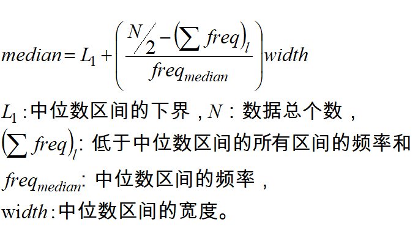

- [Chapter 2 DataPreprocessing](#chapter-2-datapreprocessing)
  - [认识数据](#%e8%ae%a4%e8%af%86%e6%95%b0%e6%8d%ae)
    - [属性类型](#%e5%b1%9e%e6%80%a7%e7%b1%bb%e5%9e%8b)
      - [分类型 VS 数值型](#%e5%88%86%e7%b1%bb%e5%9e%8b-vs-%e6%95%b0%e5%80%bc%e5%9e%8b)
      - [离散属性 VS 连续属性](#%e7%a6%bb%e6%95%a3%e5%b1%9e%e6%80%a7-vs-%e8%bf%9e%e7%bb%ad%e5%b1%9e%e6%80%a7)
      - [对称二元属性 VS 非对称二元属性](#%e5%af%b9%e7%a7%b0%e4%ba%8c%e5%85%83%e5%b1%9e%e6%80%a7-vs-%e9%9d%9e%e5%af%b9%e7%a7%b0%e4%ba%8c%e5%85%83%e5%b1%9e%e6%80%a7)
    - [数据类型](#%e6%95%b0%e6%8d%ae%e7%b1%bb%e5%9e%8b)
    - [数据的统计描述](#%e6%95%b0%e6%8d%ae%e7%9a%84%e7%bb%9f%e8%ae%a1%e6%8f%8f%e8%bf%b0)
      - [中心趋势度量](#%e4%b8%ad%e5%bf%83%e8%b6%8b%e5%8a%bf%e5%ba%a6%e9%87%8f)
      - [数据散布](#%e6%95%b0%e6%8d%ae%e6%95%a3%e5%b8%83)
      - [可视化](#%e5%8f%af%e8%a7%86%e5%8c%96)
    - [数据的相似性度量](#%e6%95%b0%e6%8d%ae%e7%9a%84%e7%9b%b8%e4%bc%bc%e6%80%a7%e5%ba%a6%e9%87%8f)
      - [标称属性数据](#%e6%a0%87%e7%a7%b0%e5%b1%9e%e6%80%a7%e6%95%b0%e6%8d%ae)
      - [二元变量属性数据](#%e4%ba%8c%e5%85%83%e5%8f%98%e9%87%8f%e5%b1%9e%e6%80%a7%e6%95%b0%e6%8d%ae)
      - [序数型变量数据](#%e5%ba%8f%e6%95%b0%e5%9e%8b%e5%8f%98%e9%87%8f%e6%95%b0%e6%8d%ae)
      - [数值属性数据](#%e6%95%b0%e5%80%bc%e5%b1%9e%e6%80%a7%e6%95%b0%e6%8d%ae)
      - [数据标准化](#%e6%95%b0%e6%8d%ae%e6%a0%87%e5%87%86%e5%8c%96)
      - [混合型数据](#%e6%b7%b7%e5%90%88%e5%9e%8b%e6%95%b0%e6%8d%ae)
  - [数据预处理](#%e6%95%b0%e6%8d%ae%e9%a2%84%e5%a4%84%e7%90%86)
    - [数据清理](#%e6%95%b0%e6%8d%ae%e6%b8%85%e7%90%86)
      - [缺失值处理](#%e7%bc%ba%e5%a4%b1%e5%80%bc%e5%a4%84%e7%90%86)
      - [噪声数据](#%e5%99%aa%e5%a3%b0%e6%95%b0%e6%8d%ae)
    - [数据集成](#%e6%95%b0%e6%8d%ae%e9%9b%86%e6%88%90)
      - [冗余数据处理](#%e5%86%97%e4%bd%99%e6%95%b0%e6%8d%ae%e5%a4%84%e7%90%86)
    - [数据归约](#%e6%95%b0%e6%8d%ae%e5%bd%92%e7%ba%a6)
      - [维归约](#%e7%bb%b4%e5%bd%92%e7%ba%a6)
      - [数据变换](#%e6%95%b0%e6%8d%ae%e5%8f%98%e6%8d%a2)

# Chapter 2 DataPreprocessing

## 认识数据

### 属性类型

属性也称**变量，特性，特征**

#### 分类型 VS 数值型

👉 分类型(Categorical)

定性的

标称(Nominal):只用于区分对象，$\,\Rightarrow \quad = or \neq \,$

如ID号，眼球颜色，邮政编码etc

序数(Ordinal):能够确定对象的序$\,\Rightarrow \quad < or > \,$

如军阶，GPAetc

👉 数值型(Numerical)

定量的

区间(Interval):值之间的差是有意义的，即存在测量单位

如摄氏度etc

比率(Ratio):值之间的差和比率都是有意义的

如长度，质量，开氏温度(即绝对温度)

#### 离散属性 VS 连续属性

#### 对称二元属性 VS 非对称二元属性

👉 二元属性

仅取两个不同值，如0/1，男/女

👉 对称二元属性

两个值一样重要

👉 非对称二元属性

一个值比另一个更重要

如化验结果，阳性较少，但显然更重要

### 数据类型

👉 记录数据

👉 图数据

👉 有序数据

### 数据的统计描述

#### 中心趋势度量

👉 均值(mean)

中列数：数据集的最大和最小值的平均值

👉 中位数(median)

采用的是**近似值估计(线性插值)**

👉 众数(mode)

#### 数据散布

👉 极差

👉 四分位数

👉 四分位数极差
$$
    IQR = Q_3 - Q_1 \\
    Q_3是中位数后面的四分位数，Q_1是中位数前面的四分位数
$$

👉 方差，标准差

👉 五数概括：
$$
    [min,Q_1,median,Q_3,max]
$$
常用盒图(箱线图)表示

#### 可视化

👉 分位数图(观察单变量分布)

[详见BLOG](https://znonymous.me/2016/06/23/q-q-plot-introduction/)

👉 分位数-分位数图

刻画一个分布到另一个分布**是否有漂移**

👉 直方图

刻画数据总体分布情况

👉 散点图

由于二维数据较多，一般小于等于三维

### 数据的相似性度量

#### 标称属性数据

👉标称变量——是二元变量的拓广，它可以取**多于两种状态值**

👉相异性度量方法
$$
    对于两个对象i,j，它们的相异性由下面的公式度量\\
    d(i,j) = \frac{p-m}{p}\\
    d(i,j)称为相异度,m是状态取值匹配的变量数目 \,p是变量数目
$$
[详见BLOG](https://blog.csdn.net/radar1985/article/details/15812405)

#### 二元变量属性数据

👉 二元变量的相似度
$$
    相似度sim(i,j) = 1-d(i,j)
$$

① 获取列联表

② 计算相异度

若是**对称的二元变量**
$$
    d(i,j) = \frac{r+s}{q+r+s+t}
$$
若是**不对称的二元变量(1比0更重要)**
$$
    d(i,j) = \frac{r+s}{q+r+s} = 1-\frac{q}{q+r+s} = 1- Jaccard(i,j)\\
    t可以省略，对于两个对象来说，变量的值都是0，不重要
$$
👉补充：雅卡尔系数(Jaccard Index)(又称交并比)
$$
    Jaccard(A,B) = \frac{\mid A \bigcap B \mid}{\mid A \bigcup B \mid }
$$
👉补充：雅卡尔距离(Jaccard Distance)
$$
    d_J(A,B) = 1 - J(A,B)
$$

#### 序数型变量数据

👉将变量的值映射为**秩**
$$
    变量f由M_f个状态，这些有序的状态定义了一个排列1,\cdots,M_f
$$
👉相异度计算

用秩来代替变量的值.
$$
    设第i个对象变量f的值x_{if}
$$

可以将变量秩的值域映射到$\,[0,1]\,$区间
$$
    z_{if} = \frac{r_{if}-1}{M_{if}-1}
$$

#### 数值属性数据

👉使用**距离**度量两个**数据对象**的相似性

👉闵可夫斯基距离(p范数)

若p=1,称为曼哈顿距离

若p=2，称为欧几里得距离(欧氏距离)

#### 数据标准化

注意上图的**最后一句话**，使用标准差是将数据缩放成**均值为0，方差为1**的分布

#### 混合型数据

👉基本思想：将不同类型的变量组合**单个相异度矩阵中**，把所有变量转换到共同的值域区间，一般是[0,1]

## 数据预处理

主要任务

👉数据清理

处理缺失值，噪声数据，删除孤立点，解决不一致性(编码不一致等)

👉数据集成

集成多个数据库

👉数据规约

将数据集压缩，但可以得到相近的结果

👉数据变换

规范化和聚集

👉数据离散化

将连续数据进行离散处理

### 数据清理

#### 缺失值处理

策略：

👉使用变量的平均值填充空缺值

👉使用与给定元组属同一类的所有样本的平均值

👉使用最可能的值填充空缺值：使用贝叶斯公式或判定树等预测方法

Ex

#### 噪声数据

👉分箱

### 数据集成

#### 冗余数据处理

👉数值型数据——相关分析

👉相关系数(皮尔逊相关系数)

$$
    r_{A,B} > 0, A和B正相关\\
    r_{A,B} = 0,A和B不相关\\
    r_{A,B}< 0, A和B负相关
$$

👉协方差：衡量两个变量的变化趋势是否一致

$$
    Cov_{A,B} > 0, A,B同时倾向大于各自的期望值\\
    Cov_{A,B} < 0, 若A大于其期望值，则B小于其期望值\\
    若两个变量独立，则Cov_{A,B}=0,但反之不成立
$$

👉标称型数据——卡方检验(chi-square test)

$$
    与概率论数理统计中数理统计部分一样，构造检验统计量\chi^2\\
    \chi^2 = \sum_{i=1}^{c} \sum_{j=1}^{r} \frac{(\sigma_{ij}-e_{ij})^2}{e_{ij}} \\
    该卡方分布自由度为(c-1)\times (r-1)
$$
$$
    \begin{aligned}
        e_{ij} &= Pro(A=a_i) \times Pro(B=b_j) \times N\\
        &= \frac{count(A=a_i)}{N} \times \frac{count(B=b_j)}{N} \times N\\
        &= \frac{count(A=a_i)\times count(B=b_j)}{N}
    \end{aligned}
$$
$$
    \sigma_{ij}是(a_i,b_j)的观测频度(即实际计数)\\
    e_{ij}是(a_i,b_j)的期望频度\\
    N是数据元组的个数
$$
Ex

这个和数理统计中假设检验一样，**先假设两个属性不相关，计算检验统计量的值，在已知显著性水平的条件下查表，得出的值与检验统计量的值比较，看在拒绝域内还是在接受域内，判断假设是否正确，从而判断两个属性是否相关。**
$$
    上例自由度为(2-1)\times (2-1) = 1,查表得在显著性水平为0.999的条件下(\chi^2 = 10.828)\\
    \Rightarrow 拒绝不相关的假设，这两个属性强相关
$$

### 数据归约

👉思想：**降维**

#### 维归约

👉小波分析

常用于信号处理和图像处理中

主要思想是过滤高频信号，保留低频信号

👉PCA(Principal component analysis)主成份分析

基本思想：找到一个投影，使数据的方差最大化,达到降维的目的

但这样会生成新的特征——新问题——怎么描述新的特征

[PCA BLOG1](https://blog.csdn.net/program_developer/article/details/80632779)

[PCA BLOG2](https://www.cnblogs.com/fionacai/p/5767973.html)

[奇异值分解](https://www.cnblogs.com/endlesscoding/p/10033527.html)

👉特征筛选

通过删除不相干的属性减少数据量,常用于分类或回归

例：某几个属性加起来的分类效果最好，就可以删除其他的属性，达到降维的目的

但问题是，不知道哪些属性加起来效果最好。即d个属性有2的d次幂个可能的子集

策略：**启发式方法**——找到近似最优

① 逐步向前选择，先选一个对于分类最好效果的特征，然后逐步增加特征

② 逐步向后删除，删除一个，看分类效果性能是否增加，逐步删除

③ 两者结合

算法：👉**信息增益(Information Gain)**

信息熵：刻画系统的**混乱程度**(随机程度)。熵越高越混乱(随机程度越高)
$$
    H(X) = -\sum_{i=1}^{n} p(x_i)\log p(x_i)
$$
条件信息熵：刻画已知X的基础上，需要多少信息来描述Y
$$
    \begin{aligned}
        H(Y\mid X) &= \sum_{x\in X} p(x)H(Y\mid X=x)
        &= -\sum_{x\in X} p(x) \sum_{y\in Y} p(y\mid x)\log p(y\mid x)
    \end{aligned}
$$
信息增益：刻画已知X的基础上，能够**节约多少信息**来描述Y
$$
    IG(Y\mid X) = H(Y) - H(Y\mid X)
$$
所以IG越大，表明X与Y越相关，由于这是一个分类问题，所以选择IG大的特征，删除IG小的特征

👉数量规约

👉回归

👉聚类

👉采样

👉数据立方体聚集

#### 数据变换

👉规范化

上图中最小-最大规范化，规范到$\,[new\_{min_A},new\_{max_A}]\,$

👉离散化(对于连续数据)

👉概念分层(对于标称数据)