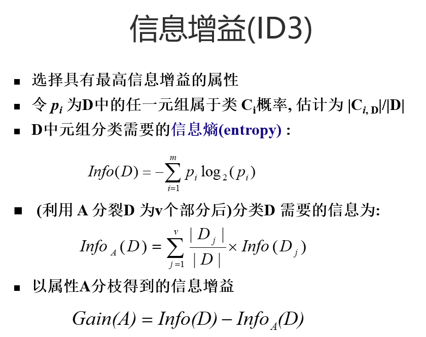
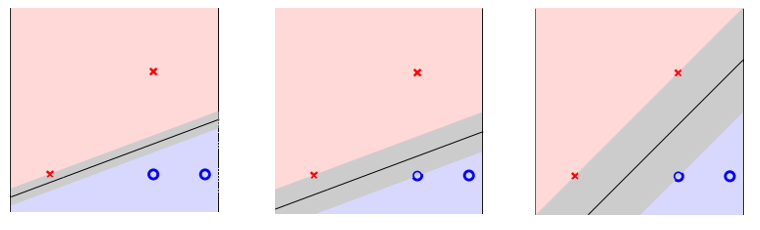
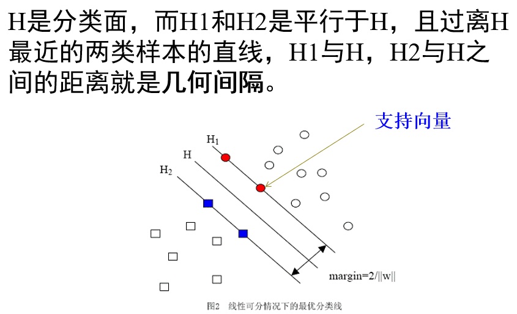
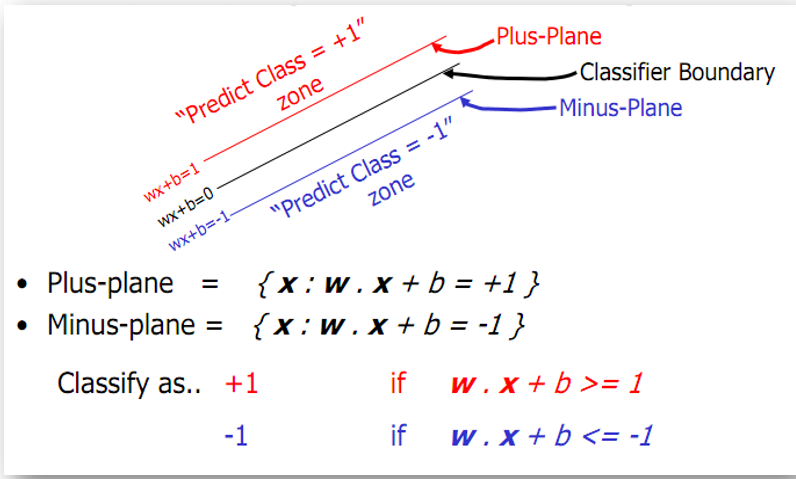

- [分类](#%e5%88%86%e7%b1%bb)
  - [决策树](#%e5%86%b3%e7%ad%96%e6%a0%91)
    - [DT算法思想](#dt%e7%ae%97%e6%b3%95%e6%80%9d%e6%83%b3)
    - [DT算法流程](#dt%e7%ae%97%e6%b3%95%e6%b5%81%e7%a8%8b)
    - [DT算法伪代码](#dt%e7%ae%97%e6%b3%95%e4%bc%aa%e4%bb%a3%e7%a0%81)
    - [属性选择度量——如何选择最优分类能力的属性](#%e5%b1%9e%e6%80%a7%e9%80%89%e6%8b%a9%e5%ba%a6%e9%87%8f%e5%a6%82%e4%bd%95%e9%80%89%e6%8b%a9%e6%9c%80%e4%bc%98%e5%88%86%e7%b1%bb%e8%83%bd%e5%8a%9b%e7%9a%84%e5%b1%9e%e6%80%a7)
      - [信息增益IG——ID3](#%e4%bf%a1%e6%81%af%e5%a2%9e%e7%9b%8aigid3)
      - [信息增益率——C4.5](#%e4%bf%a1%e6%81%af%e5%a2%9e%e7%9b%8a%e7%8e%87c45)
      - [Gini指标——CART](#gini%e6%8c%87%e6%a0%87cart)
    - [过拟合](#%e8%bf%87%e6%8b%9f%e5%90%88)
      - [树剪枝](#%e6%a0%91%e5%89%aa%e6%9e%9d)
    - [从DT提取规则](#%e4%bb%8edt%e6%8f%90%e5%8f%96%e8%a7%84%e5%88%99)
  - [KNN](#knn)
    - [KNN算法思想](#knn%e7%ae%97%e6%b3%95%e6%80%9d%e6%83%b3)
    - [KNN优缺](#knn%e4%bc%98%e7%bc%ba)
    - [KNN常见问题](#knn%e5%b8%b8%e8%a7%81%e9%97%ae%e9%a2%98)
  - [朴素贝叶斯](#%e6%9c%b4%e7%b4%a0%e8%b4%9d%e5%8f%b6%e6%96%af)
    - [贝叶斯定理](#%e8%b4%9d%e5%8f%b6%e6%96%af%e5%ae%9a%e7%90%86)
    - [朴素贝叶斯分类器](#%e6%9c%b4%e7%b4%a0%e8%b4%9d%e5%8f%b6%e6%96%af%e5%88%86%e7%b1%bb%e5%99%a8)
  - [SVM(支持向量机)](#svm%e6%94%af%e6%8c%81%e5%90%91%e9%87%8f%e6%9c%ba)
    - [SVM线性分类器](#svm%e7%ba%bf%e6%80%a7%e5%88%86%e7%b1%bb%e5%99%a8)
    - [SVM基本思想——最大间隔化](#svm%e5%9f%ba%e6%9c%ac%e6%80%9d%e6%83%b3%e6%9c%80%e5%a4%a7%e9%97%b4%e9%9a%94%e5%8c%96)
      - [转化为最优化问题](#%e8%bd%ac%e5%8c%96%e4%b8%ba%e6%9c%80%e4%bc%98%e5%8c%96%e9%97%ae%e9%a2%98)

# 分类

👉 监督学习$\,VS\,$无监督学习

- 无监督学习(关联规则挖掘，聚类分析)
  - 无**label**
  - 挖掘**潜在的数据内部模式**
- 监督学习(分类，预测)
  - 数据有label
  - 通过label学习数据中的模式(模型)
  - 利用学习的模式对新数据进行分类预测

👉 监督学习框架

👉 模型分类

- 生成模型(Generative Model)
  - 从数据中学习**原始的真实数据生成模型**。常见的方法是**学习数据的联合分布**。常见的模型——**朴素贝叶斯方法，隐马尔可夫模型**
  - 特点
    - 当容量大时，生成模型容易接近真实模型
    - 能处理具有**隐含变量**的情况
- 判别模型(Discriminative Model)
  - 从数据中学习**不同类概念的区别**从而分类。如KNN,SVM,ANN,DT

## 决策树

### DT算法思想

- 自顶向下的分治方式构造决策树
- 使用**Nominal属性**的数据(如果是**Numeric属性**，则需要进行离散化)，**递归选择测试属性来划分样本**
- 测试属性是根据**启发信息或是统计信息来选择**，如**信息增益**

### DT算法流程

- 树以训练样本的**单个结点**开始
  - 如果样本都在同一类，则该结点为树叶，并用该类标记
  - 否则，选取**最有分类能力的属性**成为决策树的当前结点
- 根据分类属性将训练样本分为若干子集。对于每个子集，重复上述操作，递归形成决策树。**一旦一个属性出现在一个结点上，就不必再该结点的子代考虑它**

- 递归停止的条件
  - 结点的所有样本属于同一类
  - 没有剩余属性可以用来进一步划分样本
  - 对于某一分支，没有 **满足该分支条件的样本**，则以样本的多数类创建一个树叶

### DT算法伪代码

### 属性选择度量——如何选择最优分类能力的属性

#### 信息增益IG——ID3

[见Chapter2 维归约](DataPreprocessing.md)

👉 缺点

- 信息增益倾向于有**大量不同取值的属性**——即划分更细，更纯
  - 会出现极端的情况，即划分的每个子集都只有一个样本，此时每个类的信息熵为0

- 用信息增益率来解决这一问题

#### 信息增益率——C4.5

- 引入了$\,SplitInfo_A(D)\,$

$$
    SplitInfo_A(D) = -\sum_{j=1}^{v}\frac{|D_j|}{|D|} \times log_2 (\frac{|D_j|}{|D|})
$$

- 信息增益率的公式

$$
    Gain\_Ratio(A) = \frac{Gain(A)}{SplitInfo_A(D)}
$$

👉 选择最大增益率的属性为分裂属性

#### Gini指标——CART

👉 Gini指标**度量数据元组的不纯度**

👉 定义
$$
    gini(D) = 1 - \sum_{j=1}^{n} p_j^2\\
    数据集D基于属性A分裂为子集D_1，D_2\\
    gini_A(D) = \frac{|D_1|}{|D|} gini(D_1)+ \frac{|D_2|}{|D|}gini(D_2)\\
    \Delta gini(A) = gini(D) - gini_A(D)
$$

👉 以不纯度最小的即$\,gini_A(D)\,$最小的A来作为分裂属性 也就是$\,\Delta gini(A)\,$最大的(不纯度减小最大的)

### 过拟合

👉 监督学习普遍存在的问题

👉 过拟合的原因

- 训练样本只是真实模型下的一个抽样集
- 模型泛化能力不强

👉 解决的策略

- 增加样本集，去除噪声
- 降低模型复杂度
- Train-Validation-Test
- 加入正则项等

#### 树剪枝

👉 设定决策树的最大高度来限制树的生长

👉 设定每个结点必须包含的**最少记录数**，当结点中记录的个数小于这个数值时要停止分割

👉 剪枝的策略

- 先剪枝——提前终止树的构造
  - 选择一个合适的阈值很难
- 后剪枝——从完全生长的树中剪去树枝
  - 计算量代价大。但对于小样本的情况，后剪枝的方法较为优秀

### 从DT提取规则

👉 根据每一条路径可以创建一个规则

## KNN

### KNN算法思想

- 根据**距离函数**计算待分类样本和每个训练样本的距离(**作为相似度**)
- 选择与待分类样本距离最小的K个样本作为X的K个最近邻
- 以X的K个最近邻中的**大多数所属的类别**作为X的类别

### KNN优缺

- 优点
  - 简单，易于理解，无需训练
  - 准确度一般较高
  - 特别适合**多标签问题(对象有多个类别的标签)**，KNN比SVM表现的好
- 缺点
  - 懒惰算法，对测试样本分类时计算量大，内存开销大
  - 当样本不平衡时，效果不好
  - 可解释性较差，无法给出决策树那样的规则

### KNN常见问题

- K值设定
- 类别的判断方式
  - 投票法没有考虑近邻的距离的远近，距离更近的近邻更应该决定最终的分类，**加权投票法更恰当**
- 距离度量方式的选择
  - 当变量数变多(即高维)，欧式距离的区分能力变差
  - 值域越大的变量会在距离计算时占据主导，**应先对变量进行标准化**
- 训练样本的参考原则
  - 减少训练集的大小
  - 通过**聚类**，将聚类产生的**中心点**作为新的训练样本

## 朴素贝叶斯

### 贝叶斯定理

$$
    给定训练样本集X，假设H的先验概率P(H|X)服从贝叶斯定理\\
    P(H|X) = \frac{P(X|H)P(H)}{P(X)}
$$

👉 假设y是类变量，X是特征向量$\,X=(x_1,x_2,\cdots,x_n)\,$,有
$$
    P(y|X) = \frac{P(X|y)P(y)}{P(X)}
$$

👉 **类条件独立假设**，$\,X的n个分量相互独立\,$，即
$$
    P(y|x_1,x_2,\cdots,x_n) = \frac{P(x_1|y)P(x_2|y)\cdots P(x_n|y)P(y)}{P(x_1)P(x_2)\cdots P(x_n)} = \frac{P(y)\prod_{i=1}^{n}P(x_i|y)}{P(x_1)P(x_2)\cdots P(x_n)}
$$

👉 不需要计算$\,P(X)\,$

### 朴素贝叶斯分类器

👉 $\,\hat{y} = arg \max \limits_{y} P(y)\prod_{i=1}^{n}P(x_i|y)\,$

## SVM(支持向量机)

👉 基于统计学习理论的**VC维理论**和**结构风险最小原理**

- VC维
  - 对函数类的一种度量，可认为问题的复杂程度，**VC维越高，一个问题就越复杂**
- 结构风险
  - 经验风险$\,R_{emp}(w)\,$
    - 分类器在样本数据上的分类结果与真实结果之间的差值
  - 置信风险$\,\,\Phi(h,n)$
    - 样本数量
      - 给定的样本数量越大，学习结果越有可能正确，置信风险越小
    - 分类函数的VC维
      - VC维越大，泛化能力越差
  - 寻求经验风险和置信风险的**和最小**，即结构风险最小$\,R(w) \leq R_{emp}(w) + \Phi(h,n)\,$

👉 线性可分和不可分

- 若一个**线性函数**能够将样本完全正确的分开，则称数据是线性可分的，否则则称非线性可分

- 线性函数
  - 在一维空间是**一个点**，在二维空间是**一条直线**，在三维空间是**一个平面**
  - 线性函数有一个统一的名称——**超平面(Hyper Plane)**

### SVM线性分类器

### SVM基本思想——最大间隔化

- 最大间隔化
  - 使数据能够完全的分割开并使**支持向量所在超平面与分类面的几何间隔最大化**，所以可以将此问题转化为**最优化问题
- 分类面的函数表示为$\,g(x) = wx+b\,$
  - 此处的x是样本的向量表示
  - 此表达式不限于二维，若为n维，则w为n维向量
  - 称$\,wx+b=0\,$为分类面

- $\,H_1,H_2\,$上的点组成的下向量都称为**支持向量**

#### 转化为最优化问题

- 对于在Plus-Plane内的数据(有$\,wx+b\geq 1\,$)，归为$1类$，对于在Minus-Plane内的数据(有$\,wx+b \leq -1\,$)，归为$\,-1类\,$

$$
    对于n维空间中的某个点x_i,对应的类的值为y_i,若能有\\
    y_i(w^T x_i + b) \geq 1\,\\
    \text{因为在minus-plane中}y_i=-1,虽然wx+b \leq -1，乘上y_i仍为y_i(w^T x_i + b) \geq 1\\
    说明该分类面的分类效果好，即经验风险小
$$

👉 如何最大化几何间隔 即plus-plane(minus-plane)到分类面的距离$\,max \frac{1}{||w||}\,$

- 将$\,max \frac{1}{||w||}\,$作为目标函数，$\,y_i(w^T x_i + b) \geq 1\,$作为约束条件，问题变为有约束的优化问题
- 将目标函数变为$\,min \frac{1}{2} ||w||^2\,$

👉 如何求解该**凸二次规划问题**