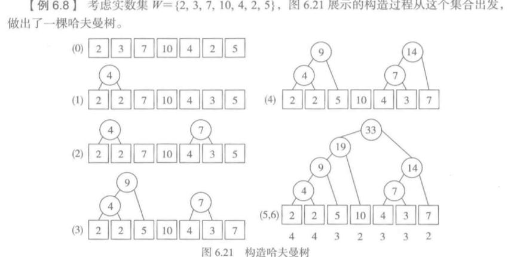
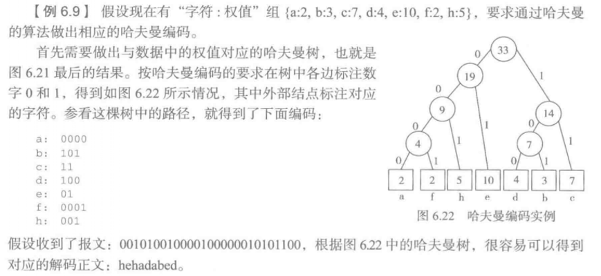

- [二叉树与树](#%e4%ba%8c%e5%8f%89%e6%a0%91%e4%b8%8e%e6%a0%91)
  - [二叉树](#%e4%ba%8c%e5%8f%89%e6%a0%91)
    - [Something Fundamental](#something-fundamental)
      - [Concepts](#concepts)
      - [ADT](#adt)
      - [遍历二叉树](#%e9%81%8d%e5%8e%86%e4%ba%8c%e5%8f%89%e6%a0%91)
    - [二叉树的List实现](#%e4%ba%8c%e5%8f%89%e6%a0%91%e7%9a%84list%e5%ae%9e%e7%8e%b0)
      - [设计和实现](#%e8%ae%be%e8%ae%a1%e5%92%8c%e5%ae%9e%e7%8e%b0)
      - [二叉树的简单应用:表达式树](#%e4%ba%8c%e5%8f%89%e6%a0%91%e7%9a%84%e7%ae%80%e5%8d%95%e5%ba%94%e7%94%a8%e8%a1%a8%e8%be%be%e5%bc%8f%e6%a0%91)
    - [优先队列](#%e4%bc%98%e5%85%88%e9%98%9f%e5%88%97)
      - [概念](#%e6%a6%82%e5%bf%b5)
      - [堆](#%e5%a0%86)
      - [优先队列的堆实现](#%e4%bc%98%e5%85%88%e9%98%9f%e5%88%97%e7%9a%84%e5%a0%86%e5%ae%9e%e7%8e%b0)
      - [堆的应用：堆排序](#%e5%a0%86%e7%9a%84%e5%ba%94%e7%94%a8%e5%a0%86%e6%8e%92%e5%ba%8f)
    - [离散事件系统模拟](#%e7%a6%bb%e6%95%a3%e4%ba%8b%e4%bb%b6%e7%b3%bb%e7%bb%9f%e6%a8%a1%e6%8b%9f)
    - [二叉树结点类](#%e4%ba%8c%e5%8f%89%e6%a0%91%e7%bb%93%e7%82%b9%e7%b1%bb)
    - [二叉树遍历](#%e4%ba%8c%e5%8f%89%e6%a0%91%e9%81%8d%e5%8e%86)
    - [哈夫曼树](#%e5%93%88%e5%a4%ab%e6%9b%bc%e6%a0%91)
      - [哈夫曼树定义](#%e5%93%88%e5%a4%ab%e6%9b%bc%e6%a0%91%e5%ae%9a%e4%b9%89)
      - [哈夫曼树算法思想](#%e5%93%88%e5%a4%ab%e6%9b%bc%e6%a0%91%e7%ae%97%e6%b3%95%e6%80%9d%e6%83%b3)
      - [实现哈夫曼树](#%e5%ae%9e%e7%8e%b0%e5%93%88%e5%a4%ab%e6%9b%bc%e6%a0%91)
      - [哈夫曼树的应用——哈夫曼编码](#%e5%93%88%e5%a4%ab%e6%9b%bc%e6%a0%91%e7%9a%84%e5%ba%94%e7%94%a8%e5%93%88%e5%a4%ab%e6%9b%bc%e7%bc%96%e7%a0%81)
  - [树与树林](#%e6%a0%91%e4%b8%8e%e6%a0%91%e6%9e%97)
    - [相关概念](#%e7%9b%b8%e5%85%b3%e6%a6%82%e5%bf%b5)
      - [树的定义(递归定义)](#%e6%a0%91%e7%9a%84%e5%ae%9a%e4%b9%89%e9%80%92%e5%bd%92%e5%ae%9a%e4%b9%89)
      - [树林定义](#%e6%a0%91%e6%9e%97%e5%ae%9a%e4%b9%89)
      - [树的度数](#%e6%a0%91%e7%9a%84%e5%ba%a6%e6%95%b0)
    - [树的性质](#%e6%a0%91%e7%9a%84%e6%80%a7%e8%b4%a8)
    - [树的实现](#%e6%a0%91%e7%9a%84%e5%ae%9e%e7%8e%b0)
      - [子结点引用表示](#%e5%ad%90%e7%bb%93%e7%82%b9%e5%bc%95%e7%94%a8%e8%a1%a8%e7%a4%ba)
      - [父结点引用表示](#%e7%88%b6%e7%bb%93%e7%82%b9%e5%bc%95%e7%94%a8%e8%a1%a8%e7%a4%ba)
      - [子结点表表示](#%e5%ad%90%e7%bb%93%e7%82%b9%e8%a1%a8%e8%a1%a8%e7%a4%ba)

# 二叉树与树

树和二叉树都属于树形结构

树形结构是由结点和结点之间的连接关系构成，但结构与线性表不同，特征如下:

① 一个结构如果不空，其中就存在唯一的其实结点，称为**树根**

② 按结构的连接关系，树根外的其余结点都有且只有一个**前驱**(这一点与线性结构相同)，但一个结点可以有**0个或者多个后继**(这一点与线性结构不同)

③ 结构里的**所有结点**都在树根结点**通过后继关系可达的结点集合里**

④ 结点之间的联系不会形成循环关系

⑤ 任意两个不同结点出发，通过后继关系可达的两个结点集合，**或互不相交**，**或一个集合是另一个集合的子集**

## 二叉树

### Something Fundamental

#### Concepts

- 概念
  - 定义

    二叉树是结点的有穷集合。这个集合或者是空集，或者其中有一个称为根结点的特殊结点，其余结点分属两棵不相交的二叉树，这两棵二叉树分别是**原二叉树的左子树和右子树**

    上述定义所定义的二叉树是一种递归结构

    下图是三棵二叉树 

    二叉树只可能有五种可能形态 

  - 空树,单点树

    不包含任何结点的二叉树——空树

    只包含一个结点的二叉树——单点树

  - 父结点,子结点

    一棵二叉树的根结点称为该树的**子树根结点**的父结点

    子树的根结点称为二叉树**树根结点**的子结点

    父结点到子结点有一条连线，称为从父结点到子结点的**边**。这种边有方向，形成一种单方向的**父子关系**。

    基于父子关系可以定义其传递关系，称为**祖先/子孙关系**，它决定了一个结点的**祖先结点或子孙结点**

    父结点相同的两个结点互为**兄弟结点**

  - 树叶

    结点的两颗子树都为空，没有子结点，这种结点称为树叶

    树中其余结点称为**分支结点**

  - 度数

    一个结点的子结点个数称为该结点的度数

    显然树叶结点的度数为0，分支结点的度数可以是1或者2

  - 路径

    从一个祖先结点到其任何子孙结点都存在一系列边，形成从前者到后者的联系。这样一系列首尾相连的边称为树中的**一条路径**

    路径中边的条数称为该路径的**长度**

  - 层数

    二叉树是一种层次结构。将树看作**最高层元素**，其子结点看作下一层元素。**规定树根的层数为0**

    显然，从树根到树种任一结点的路径长度就是该结点所在的层数

  - 高度(深度)

    一棵二叉树的高度是**树中结点的最大层数(即树里的最长路径长度)**

- 性质
  - 在非二叉树第$\,2^i\,$个结点(显然)
  - 高度为$\,h\,$的二叉树至多有$\,2^{h+1} -1\,$个结点(等比数列求和)
  - 对于任何非空二叉树$\,T\,$,如果其叶结点的个数$\,n_0\,$,度数为2的结点个数是$\,n_2\,$,则有$\,n_0 = n_2 + 1\,$。(对于满二叉树，其余种类的二叉树类推)以2为公比的等比数列，对于第n项，前n-1项的和加上1即为第n项的值，这一点可以通过公比为2的等比数列的求和公式得知

- 满二叉树、扩充二叉树、完全二叉树
  - 满二叉树

    如果二叉树中**所有分支结点的度数都是2**，则为一棵满二叉树

    

  - 扩充二叉树

    对二叉树$\,T\,$,加入足够多的**新的叶结点**，使$\,T\,$的原有结点都变成度数为2的分支结点，得到的二叉树称为$\,T\,$的扩充二叉树。

    新增结点称为$\,T\,$的外部结点，原树的结点称为内部结点

    由于补充之后的二叉树变为了满二叉树，所以显然有**扩充二叉树的外部结点个数比内部结点的个数多1**

    

    扩充二叉树的外部路径$\,EPL\,$是从树根到树中各外部结点的路径长度之和

    扩充二叉树的内部路径$\,IPL\,$是从树根到树中各内部结点的路径长度之和

    如果树中有n个内部结点，有结论
    $$
      I =  \sum_{i=0}^{n-1} l_{i}   \quad l_i是内部结点i的层数        \\
      E = \sum_{i=0}^{n} l_{i}^{'} \quad l_{i}^{'}是外部结点i的层数\\
      EPL = IPL + 2 \times n
    $$

  - 完全二叉树

    对于一棵高度为h的二叉树，如果其第0层至第h-1层的结点都满。如果第h层的结点不满，则所有结点在最左边连续排列，空位都在右边，这样的二叉树就是完全二叉树

    

    完全二叉树的性质:

    ① $\,n\,$个结点的完全二叉树高度$\,h = [ \log_2n ],$(取整符号)

    证明如下:

    完全二叉树$\,T\,$包含$\,n\,$个结点，高度是$\,h\,$。

    因为其第0层至第h-1层的结点都满，而第h层大多数情况下不满，所以有
    $$
      2^h-1 < n \leq 2^{h+1} -1 \,即 \,2^h \leq n < 2^{h+1}
    $$
    取对数得
    $$
      h \leq \log_2 n < h +1
    $$

    ② 若将n个结点完全二叉树的结点按层次并按从左到右的顺序从0开始编号，对任一结点$\,i(0\leq i \leq n-1)\,$都有：

    序号为0的结点是根

    其父结点的编号是$\,(i-1)/2\,$

    若$\,2\times i + 1 < n\,$，其左子结点序号为$\,2\times i + 1\,$,若不满足$\,2\times i + 1 < n\,$，则该结点无左子结点

    若$\,2\times i + 2 < n\,$，其左子结点序号为$\,2\times i + 2\,$,若不满足$\,2\times i + 2 < n\,$，则该结点无右子结点

    性质②十分重要，使完全二叉树可以方便的存入一个**表或数组**，可以**直接根据元素下标就能找到一个结点的子结点或父结点**，即可以完全确定二叉树的结构。

    

#### ADT

```python
ADT BinTree:
  BinTree(self,data,left,right) #创建一个新二叉树
  is_empty(self) #检查二叉树是否为空
  num_nodes(self) #求二叉树的结点个数
  data(self) #获取树根存储的数据
  left(self) #获取左子树
  right(self) #获取右子树
  set_left(self,btree) #用btree取代原来的左子树
  set_right(self,btree) #用btree取代原来的右子树
  traversal(self) #遍历二叉树中各结点数据的迭代器
  forall(self,op) #对二叉树中的每个结点的数据执行操作op
```

#### 遍历二叉树

两种方式——深度优先遍历和宽度优先遍历

对于深度优先遍历 有三种方式:

**先根序**遍历 —— 访问根结点 - 遍历左子树 - 遍历右子树

**中根序**遍历 —— 遍历左子树 - 访问根结点 - 遍历右子树

**后根序**遍历 —— 遍历左子树 - 遍历右子树 - 访问根结点

可以把树看作一个状态空间(在[栈与队列](栈和队列.md)中有过说明)

在搜索过程中记录从一个状态到另一状态的联系，将其看作结点间链接，这种搜索过程中实际构造出了一棵树，称为**搜索树**

### 二叉树的List实现

从简单来看，二叉树的结点是一个**三元组**，由左右子树和本结点数据组成

#### 设计和实现

注意 二叉树是递归结构

在```list```中可以采用以下的设计:

① 空树用``None``表示

② 非空二叉树用包含三个元素的表``[d,l,r]``表示。其中``d``表示存在根结点的元素，``l``和``r``是两棵子树，采用与整个二叉树同样结构的``list``表示

#### 二叉树的简单应用:表达式树

即在[栈和队列](栈和队列.md)提及的表达式

二元表达式可以映射到二叉树上:

① 以操作数作为**叶结点**中的数据

② 以运算符作为**分支结点**的数据

如下图:


对于表达式树的遍历

先根序遍历得到的是 前缀表达式

后根序遍历得到的是 后缀表达式

对称序遍历得到的是 中缀表达式

### 优先队列

#### 概念

优先队列的特点是**存入其中的每项数据都另外附有一个数值，表示优先级**

优先队列应该保证在任何时候弹出/访问的都是优先级最高的

优先队列的实际应用：① 各项工作的计划开始时间 ② 项目中各项任务的紧迫程度 etc

关于优先队列的实现方法有两种实现方案:

① 存入数据时，保证表中元素始终按照优先级排序，可以直接取到当时在表里最优先的元素

② 存入数据时简单(如顺序表存入表尾，链接表表头``prepend``)，取用时检索找到优先级最高元素

下面考虑采用①

注意基于**线性结构(顺序表和链接表)**，在插入元素和取出元素的操作中总有一种具有**线性复杂度**的操作 因为元素是按优先级顺序线性排列的，肯定无法摆脱线性结构的局限 所以必须采用其他的数据结构来提高效率 

在介绍二叉树的性质时有$\,n\,$个结点的完全二叉树高度$\,h = [ \log_2n ],$，所以最长的一条路径的复杂度为$\,O(\log_2 n)\,$

因此可以考虑用树形结构来优化优先队列

下面先介绍堆

#### 堆

堆就是结点里存储数据的**完全二叉树**

但是在存储时要满足一种特殊的**堆序**：
$$
  \text{任一结点里所存的数据优先级} \geq \text{其子节点(如果存在)里的数据}
$$

下面所讨论的序都是**小元素优先**

#### 优先队列的堆实现

插入元素称为**向上筛选** 弹出元素称为**向下筛选**

① 插入元素

向上筛选: **不断用新元素与其父结点的数据比较，如果新元素较小就交换两个元素的位置** 这个操作的比较和交换次数不会超过二叉树中最长路径，该操作的时间复杂度为$\,O(\log n)\,$

② 弹出元素

向下筛选：

由于序是小元素优先，所以弹出元素即弹出堆顶元素。

但是弹出堆顶元素之后，改变了堆的结构，原来的堆变成了两个子堆。但只需要填补一个堆顶元素就能恢复堆结构。

由堆的性质，取出堆的最后一个元素(优先级最低)，不改变堆的结构。

所以从原堆中取下最后一个元素，把它作为堆顶，此时是一个完全二叉树，但不满足堆序(**除该元素不满足堆序外**，其余元素都满足堆序)。所以还需要恢复堆序使其变为一个堆。恢复堆序的操作称为**向下筛选**

设取出的元素为$\,e\,$，操作步骤如下：

用$\,e\,$与两个子堆的根元素比较，最小的作为整个堆的堆顶

若$\,e\,$不是最小，则两个子堆(A B)中有一个最小，设A的根元素最小，将其移到堆顶，$\,e\,$移到A的堆顶

进行比较的迭代，不断进行交换，与**向上筛选**的思想类似

若某次比较中$\,e\,$最小，以$\,e\,$为顶的局部树已为堆，整体也是堆

若$\,e\,$已经落到堆的底部，堆也恢复完成

总结弹出元素的步骤如下：

弹出当时的堆顶 - 取堆最后的元素作为完全二叉树的根 - 执行一次向下筛选操作

前两步的复杂度是$\,O(1)\,$, 最后一步的复杂度为$\,O(\log n)\,$，所以弹出元素的时间复杂度也为$\,O(\log n)\,$

代码实现

其中需要注意的函数是``buildheap``——构建初始堆

思路是，将每一个叶结点看作一个堆，不断向上建堆

设高度为$\,h\,$,前$\,h-1\,$层的结点总数为$\,2^h-1\,$,最左下角的叶结点的编号即为$\,2^h-1\,$(因为是从0开始的编号) 完全二叉树结点数的最大值为$\,2^{h+1} -1\,$(即满二叉树)，做如下运算：
$$
  [(2^{h+1} -1) / 2] (\text{取整运算}) = 2^h-1
$$
所以最左下角的叶结点的编号可以如此计算

复杂度分析

创建初始堆的复杂度$\,O(n)\,$ 但只需做一次

插入和弹出操作的复杂度$\,O(\log n)\,$

#### 堆的应用：堆排序

如果一个连续表里存储的数据是一个**小顶堆**，按优先队列的操作方式反复弹出堆顶元素，能够得到一个递增序列

关于弹出的元素存放的问题，可以这样解决

弹出一个元素，表的尾部空出一个位置，可以将弹出的元素放入

### 离散事件系统模拟

被模拟系统的行为可以抽象为一些离散事件的发生，所发生的事件可以引发新的事件etc。

这种系统的特征：

① 系统运行中可能不断发生一些事件(带有一定的随机性)

② 事件之间不是独立的

模拟中的事件经常需要排队，队列结构适合记录事件

### 二叉树结点类

### 二叉树遍历

### 哈夫曼树

之前说过**扩充二叉树**的外部路径的长度(根到其外部结点的路径长度之和)
$$
  E = \sum_{i=1}^{m} l_i
$$
$\,m\,$是扩充二叉树中外部结点的个数，$\,l_i\,$是从根到外部结点$\,i\,$的路径长度

下面对上述定义进行扩展，给每一个外部结点标一个数值，称为该结点的**权**，**带权扩充二叉树的外部路径长度**
$$
  WPL=\sum_{i=1}^{m} \omega_i l_i
$$

#### 哈夫曼树定义

设有实数集$\,W=\{ w_0,w_1,\cdots,w_{m-1} \}\,$,$\,T\,$是一棵扩充二叉树，其$\,m\,$个外部结点分别以$\,W\,$中的集合为权,且$\,WPL\,$在所有这样的扩充二叉树中**达到最小**，称$\,T\,$是$\,W\,$的**最优二叉树**即**哈夫曼树**

#### 哈夫曼树算法思想

Huffman提出一个算法：可以从任意实数集合构造出与之对应的哈夫曼树，描述如下

算法的输入为实数集$\,W=\{ w_0,w_1,\cdots,w_{m-1} \}\,$

算法中维护一个包含$\,k\,$棵二叉树的集合$\,F\,$,最初$\,k=m\,$且$\, F = \{ T_0,T_1,\cdots,T_{m-1} \} \,$,其中每个$\,T_i\,$是一棵只包含权为$\,\omega_i\,$的根结点的**单点二叉树**

算法重复执行下面两个步骤，直到$\,F\,$中剩下一棵树为止:

① 构造一棵新二叉树，其左右子树是从集合$\,F\,$中选取的两棵**权最小的二叉树**，新二叉树的根结点的权值设置为两棵子树的根结点的权值之和

② 将两棵子树从$\,F\,$中删除，并将新二叉树加入$\,F\,$

**注意** 哈夫曼树不唯一

下图是一个构造哈夫曼树的例子



#### 实现哈夫曼树

#### 哈夫曼树的应用——哈夫曼编码

$$
  C=\{ c_0,c_1,\cdots,c_{m-1} \},
  W= \{ w_0,w_1,\cdots,w_{m-1} \}
$$
$\,C\,$是需要编码的字符集合，$\,W\,$是$\,C\,$中各个字符在实际信息传输(或信息存储)中出现的频率。要求为$\,C\,$设计一套二进制编码，使**用这种编码存储/传输时的平均开销最小**且**任一字符的编码不是另一字符编码的前缀**

编码方法

① 构造哈夫曼树

② 得到的哈夫曼树中，各**分支结点**到其左子结点的边标注为0，到其右子结点的边标注为1

③ 从根结点到外部结点的路径上的二进制序列就是该外部结点对应的编码

可以证明**以上述方式得到的哈夫曼编码是$\,C\,$的最优编码**

例子如下



## 树与树林

### 相关概念

#### 树的定义(递归定义)

一棵树是$\,n\,$个结点的有限集$\,T\,$,当$\,T\,$非空时满足：

① $\,T\,$中有且仅有一个特殊节点$\,r\,$称为树的根

② 除根结点外的其余节点分为$\,m\,$个**互不相交**的非空有限子集$\,T_0,T_1,\cdots,T_{m-1}\,$,每个集合$\,T_i\,$是一棵非空树，称为$\,r\,$的子树

#### 树林定义

0棵或多棵树的集合称为一个树林

#### 树的度数

该树种度数最大的结点的度数

### 树的性质

① 在度数为$\,k\,$的树中，第$\,i\,$层至多有$\,k_i\,$个结点

② 度数为$\,k\,$，高度为$\,h\,$的树中至多有
$$
  \frac{k^{h+1}-1}{k-1}
$$

对于$\,k\,$度完全树：除最下一层分支结点中最右的那个结点的度数可能小于$\,k\,$外，其余分支结点的度数均为$\,k\,$，有以下性质

① $\,n\,$个结点的$\,k\,$度完全数，高度为$\,h=[\log_k n]\,$

② $\,n\,$个结点的树里有$\,n-1\,$条边

### 树的实现

#### 子结点引用表示

思想与二叉树的**结点链接**的思想现统：用一个数据单元表示结点，通过结点间的链接表示树的结构。但与二叉树不同的是，一棵树的度数不确定，所以对实现度数很多的结点的链接带来了困难，也会造成对于度数很少的结点的链接的浪费

在$\,m\,$度结点表示的$\,n\,$个结点的树中，恰有$\,n\times (m-1) + 1\,$个空树引用域

#### 父结点引用表示

任何树结构，除了树根之外的每个结点有且仅有一个**父结点**。

可以用顺序表表示一个树，每个表元素为一个结点，结点由两部分组成：结点数据和父结点引用。树中的结点通常在表中按某种遍历顺序排列，如下图是按照**层次序**排列


该技术的优点是**存储开销小**，对$\,n\,$个结点的树，需要空间复杂度$\,O(n)\,$

#### 子结点表表示

用一个连续表存储树中各结点的信息，每个结点关联一个**子结点表** 如下图所示

