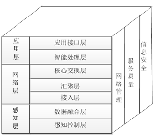

- [物联网概念与架构](#%e7%89%a9%e8%81%94%e7%bd%91%e6%a6%82%e5%bf%b5%e4%b8%8e%e6%9e%b6%e6%9e%84)
  - [物联网定义](#%e7%89%a9%e8%81%94%e7%bd%91%e5%ae%9a%e4%b9%89)
  - [物联网主要特征](#%e7%89%a9%e8%81%94%e7%bd%91%e4%b8%bb%e8%a6%81%e7%89%b9%e5%be%81)
  - [物联网体系结构模型](#%e7%89%a9%e8%81%94%e7%bd%91%e4%bd%93%e7%b3%bb%e7%bb%93%e6%9e%84%e6%a8%a1%e5%9e%8b)
  - [物联网技术体系](#%e7%89%a9%e8%81%94%e7%bd%91%e6%8a%80%e6%9c%af%e4%bd%93%e7%b3%bb)
  - [物联网系统的组成](#%e7%89%a9%e8%81%94%e7%bd%91%e7%b3%bb%e7%bb%9f%e7%9a%84%e7%bb%84%e6%88%90)

# 物联网概念与架构

## 物联网定义

通过各种**信息感知**设施，按约定的**通信协议**将智能物件互联起来，通过各种通信网络进行信息**传输与交换**，以实现决策与控制的一种**信息网络**

## 物联网主要特征

- 全面感知
- 可靠传输
- 智能处理
- 自动控制

## 物联网体系结构模型

- 感知层——位于底层，是实现物联网的基础，联系物理世界与虚拟世界的纽带
  - 感知控制层——实现**全面感知和自动控制**
  - 数据融合层——将不同感知节点、不同模式、不同煤质、不同时间、不同表示的数据进行相关和综合
- 网络层——位于体系结构的中间，为应用层提供**数据传输服务**
  - 接入层——把感知层获取的数据信息通过网络技术进行汇总
  - 汇聚层——区域性网络的信息汇聚点
  - 核心交换层——为物联网提供**高速、安全、有服务质量保障力**的通信环境
- 应用层——解决**数据处理和人机交互**问题
  - 智能处理层——对感知数据的**存储、查询、分析、挖掘**
  - 应用接口层——完成**服务发现和服务呈现**
- 支持物联网共性需求的功能面
  - 网络管理
  - 服务质量
  - 信息安全

## 物联网技术体系

- 感知控制(信息获取)——实现物联网的基础
  - 电子标签技术
  - RFID技术
  - 智能传感器技术
  - 智能化传感网节点技术
  - GPS
  - 数据融合与处理技术
- 网络传输(主要为传感网、通信网络)
  - 接入网技术
    - 传感网技术
    - ZigBee技术
    - 蓝牙技术
  - 汇聚网技术
    - 无线网络技术
    - 有线网络技术
  - 承载网技术
- 系统应用
  - 海量数据智能处理
  - 应用接口技术

## 物联网系统的组成

- 软件平台
  - 信息感知系统软件
  - 物联网中间件系统软件
  - 网路操作系统
  - 物联网信息管理系统
- 硬件平台
  - 传感网
  - 承载网
  - 信息服务系统