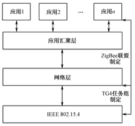

- [短距无线通信技术](#短距无线通信技术)
  - [802.15.4/ZigBee协议标准](#802154zigbee协议标准)
    - [802.15.4标准](#802154标准)
      - [物理层](#物理层)
      - [MAC层](#mac层)
    - [ZigBee协议体系](#zigbee协议体系)
      - [ZigBee网络层](#zigbee网络层)

# 短距无线通信技术

👉 无线通信网按照通信距离划分为**无线个域网、无线局域网、无线城域网、无线广域网**

## 802.15.4/ZigBee协议标准

### 802.15.4标准

👉 802.15.4标准只定义了**物理层**与数据链路层的**MAC层**

#### 物理层

- 能量检测
- 链路质量指示
- 空闲信道评估

#### MAC层

- 信道访问机制——CSMA/CA(带有冲突避免的载波侦听多路访问)
- PAN的建立和运行
  - 信道扫描——选择合适的信道
  - PAN标识符冲突检测
- 关联、解关联
  - 关联——设备在加入网络时，向协调器注册、身份认证
  - 解关联——协调器或者关联的设备请求离开PAN
- PAN同步机制——设备与协调器保持同步
  - 支持信标的同步
  - 无信标同步
  - 孤立设备重排列
- 事物处理
- 可靠性
- 功耗考量

### ZigBee协议体系

👉 建立在802.15.4标准之上 由**高层应用标准、应用汇聚层、网络层、802.15.4协议**组成

#### ZigBee网络层

👉 负责拓扑结构的建立和维护网络连接

👉 拓扑结构有**星型、树型、网状**

👉 包括逻辑链路控制子层(LLC)，此子层是基于IEEE 802.2标准的

👉 网络特点

- 低功耗
- 低成本
- 可靠、安全
- 网络容量大
- 短时延
- 近距离
- 自组织、自配置、自愈能力

