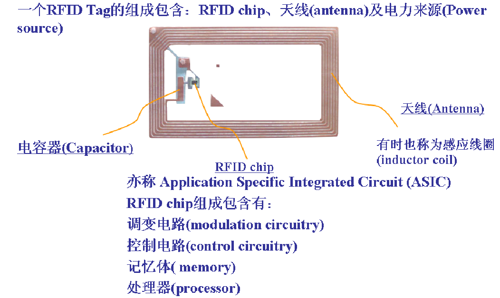
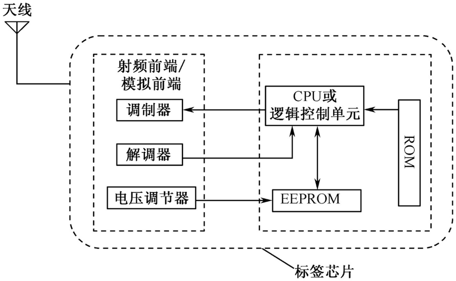
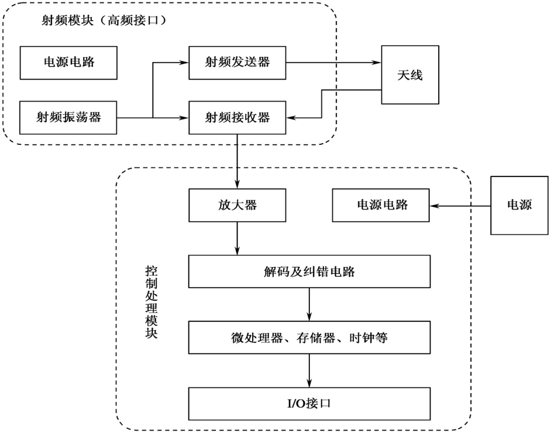
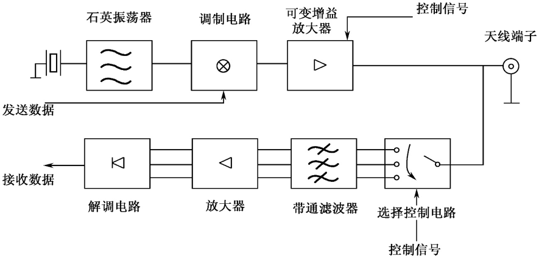
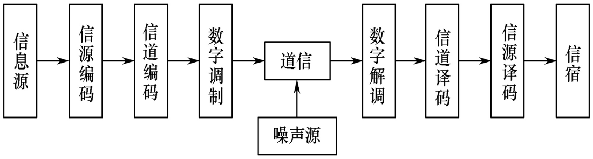
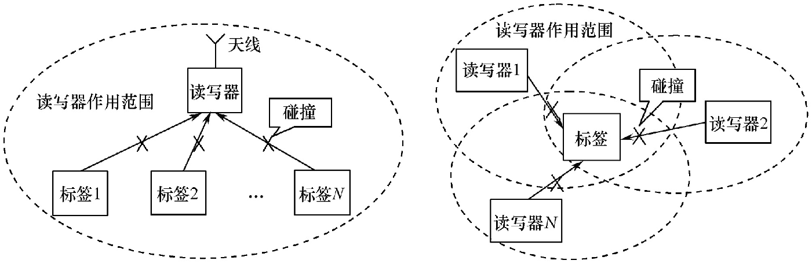
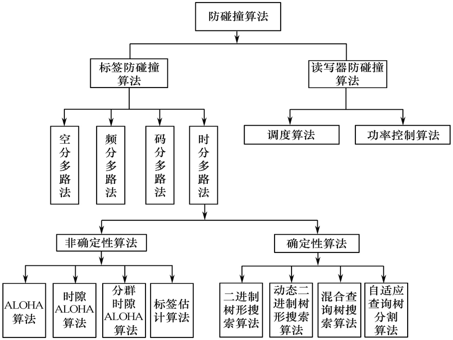

- [标签与射频识别技术](#%e6%a0%87%e7%ad%be%e4%b8%8e%e5%b0%84%e9%a2%91%e8%af%86%e5%88%ab%e6%8a%80%e6%9c%af)
  - [信息感知技术类别](#%e4%bf%a1%e6%81%af%e6%84%9f%e7%9f%a5%e6%8a%80%e6%9c%af%e7%b1%bb%e5%88%ab)
    - [RFID技术](#rfid%e6%8a%80%e6%9c%af)
  - [传输线理论](#%e4%bc%a0%e8%be%93%e7%ba%bf%e7%90%86%e8%ae%ba)
  - [谐振电路](#%e8%b0%90%e6%8c%af%e7%94%b5%e8%b7%af)
  - [天线](#%e5%a4%a9%e7%ba%bf)
    - [天线在RFID系统的工作原理](#%e5%a4%a9%e7%ba%bf%e5%9c%a8rfid%e7%b3%bb%e7%bb%9f%e7%9a%84%e5%b7%a5%e4%bd%9c%e5%8e%9f%e7%90%86)
    - [天线种类](#%e5%a4%a9%e7%ba%bf%e7%a7%8d%e7%b1%bb)
    - [天线的辐射](#%e5%a4%a9%e7%ba%bf%e7%9a%84%e8%be%90%e5%b0%84)
    - [天线的电参数](#%e5%a4%a9%e7%ba%bf%e7%9a%84%e7%94%b5%e5%8f%82%e6%95%b0)
    - [RFID系统常用天线](#rfid%e7%b3%bb%e7%bb%9f%e5%b8%b8%e7%94%a8%e5%a4%a9%e7%ba%bf)
    - [不同频段的RFID天线技术](#%e4%b8%8d%e5%90%8c%e9%a2%91%e6%ae%b5%e7%9a%84rfid%e5%a4%a9%e7%ba%bf%e6%8a%80%e6%9c%af)
  - [电子标签](#%e7%94%b5%e5%ad%90%e6%a0%87%e7%ad%be)
    - [电子标签的分类](#%e7%94%b5%e5%ad%90%e6%a0%87%e7%ad%be%e7%9a%84%e5%88%86%e7%b1%bb)
    - [电子标签的组成结构](#%e7%94%b5%e5%ad%90%e6%a0%87%e7%ad%be%e7%9a%84%e7%bb%84%e6%88%90%e7%bb%93%e6%9e%84)
      - [电子标签的天线](#%e7%94%b5%e5%ad%90%e6%a0%87%e7%ad%be%e7%9a%84%e5%a4%a9%e7%ba%bf)
      - [电子标签的芯片](#%e7%94%b5%e5%ad%90%e6%a0%87%e7%ad%be%e7%9a%84%e8%8a%af%e7%89%87)
        - [电子标签的射频前端](#%e7%94%b5%e5%ad%90%e6%a0%87%e7%ad%be%e7%9a%84%e5%b0%84%e9%a2%91%e5%89%8d%e7%ab%af)
  - [RFID读写器](#rfid%e8%af%bb%e5%86%99%e5%99%a8)
    - [读写器的功能](#%e8%af%bb%e5%86%99%e5%99%a8%e7%9a%84%e5%8a%9f%e8%83%bd)
    - [读写器的基本构成](#%e8%af%bb%e5%86%99%e5%99%a8%e7%9a%84%e5%9f%ba%e6%9c%ac%e6%9e%84%e6%88%90)
      - [读写器天线模块](#%e8%af%bb%e5%86%99%e5%99%a8%e5%a4%a9%e7%ba%bf%e6%a8%a1%e5%9d%97)
      - [读写器射频模块](#%e8%af%bb%e5%86%99%e5%99%a8%e5%b0%84%e9%a2%91%e6%a8%a1%e5%9d%97)
      - [读写器逻辑控制模块](#%e8%af%bb%e5%86%99%e5%99%a8%e9%80%bb%e8%be%91%e6%8e%a7%e5%88%b6%e6%a8%a1%e5%9d%97)
      - [读写器结构形式](#%e8%af%bb%e5%86%99%e5%99%a8%e7%bb%93%e6%9e%84%e5%bd%a2%e5%bc%8f)
      - [读写器管理技术](#%e8%af%bb%e5%86%99%e5%99%a8%e7%ae%a1%e7%90%86%e6%8a%80%e6%9c%af)
  - [RFID相关的编码与调制技术](#rfid%e7%9b%b8%e5%85%b3%e7%9a%84%e7%bc%96%e7%a0%81%e4%b8%8e%e8%b0%83%e5%88%b6%e6%8a%80%e6%9c%af)
  - [RFID防碰撞技术](#rfid%e9%98%b2%e7%a2%b0%e6%92%9e%e6%8a%80%e6%9c%af)

# 标签与射频识别技术

## 信息感知技术类别

- 条码技术
  - 优点：易于制作、数据输入速度快、识别准确、识别设备结构简单
  - 缺点：必须对着扫描仪才可以成功读取、条形码损坏则无法识别、只能识别制造商和产品类别
- 二维码识别
- 光学字符识别
- 磁卡技术
- IC(Integrated Circuit Card)卡
  - 接触式——芯片**金属触点暴露在外**，该触点直接接入**IC卡接口设备**，实现与IC卡中集成电路的信息处理和交互
  - 非接触式——芯片**全部封于卡内，无暴露部分，卡内嵌有一个微型天线**，芯片与读卡器之间非接触方式进行通信
  - 非接触式IC卡的优点
    - 可靠性高——读写时**无机械接触、避免接触不良**
    - 操作方便、迅速——读写器可在10cm范围内可对卡片操作
    - 防碰撞——有**快速防碰撞机制，防止卡片之间出现数据干扰**
    - 可实现一卡多用
    - 加密性好——序列号是唯一的
- 射频技术(RFID技术)

### RFID技术

👉 识别信息存放在电子数据载体中，电子数据载体称为**标签**

👉 技术特征

- 数据的无线读写功能
- 容易小型化和多样化的形状
- 耐环境性
- 可重复使用
- 穿透性
- 数据的记忆容量大
- 系统安全、数据安全

👉 特点

- 通过**电磁耦合方式**实现的**非接触自动识别技术**
- 利用**无线电频率资源**，必须遵守无线电频率使用的规范
- 存放的识别信息是**数字化的**，可以通过**编码技术**实现多种应用
- 容易对**多标签、多读写器进行组合建网**

👉 标签分类

- 供电方式
  - 有源RFID标签
  - 无源RFID标签
  - 半有源半无源RFID标签
- 工作方式分类
  - 主动标签(Active Tags)
  - 被动标签(Passive Tags)
- 工作频率分类
  - 低频LF(30KHz-300KHz)
  - 中高频HF(3MHz-30MHz)
  - 超高频UHF(300MHz-5.8GHz)
- 射频耦合方式分类
  - 电感耦合(磁耦合)
    - 射频载波频率为13.56MHz和小于125KHz、225KHz的频段
    - 应答器几乎都是**无源的**，能量从阅读器获得
    - 工作距离较近，一般为10-20cm
    - 应答器向阅读器的数据传输采用**负载调制**，即电阻负载调制，实际是调幅(AM)
    - 阅读器向应答器的数据传输可采用数字调制方式，通常为ASK
    - 阅读器向应答器传输能量和数据**占用一个连续的间隙**，期间应答器获取能量和数据而**不传送数据**。在两次能量供应的间隙，**应答器完成向阅读器的数据传输**
  - 反向散射耦合(电磁场耦合)
    - 由于采用特高频(UHF)和超高频(SHF)，应答器和阅读器的距离大于1m
    - 应答器采用完全无源方式会有一定困难，可在应答器上安装附加电池。

## 传输线理论

👉 传输电磁能量的一种装置

👉 TEM(横电磁波)传输线

- 双线传输线
- 同轴线
- 带状线
- 微带线

## 谐振电路

👉 解决不同物体之间的无线通信问题

👉 串联谐振电路在RFID中的应用

- 在读写器的射频前端常用到**串联谐振电路**，可以使低频和高频RFID读写器有较好的能量输出
- 低频和高频RFID读写器的天线用于产生磁通量，该磁通量向电子标签提供能量，并在读写器和标签之间传递信息

串联谐振电路适用于**恒压源**，即信号源内阻很小的情况。若信号源内阻很大(近似为**恒流源**)，应采用**并联谐振电路**

👉 读写器天线构造要求

- 读写器天线上的电流最大，以使读写器线圈产生最大的磁通量
- 功率匹配，以最大程度输出读写器能量
- 足够的带宽，以使读写器信号无失真输出

👉 并联谐振电路在RFID中的应用

- 在电子标签的射频前端常采用**并联谐振电路**，可以使低频和高频RFID电子标签从读写器**耦合能量最大**
- 低频和高频RFID标签的天线用于**耦合读写器的磁通**

👉 电子标签天线的构造要求

- 电子标签天线上**感应的电压最大**，以使电子标签线圈输出最大的电压
- 功率匹配，最大程度后河来自读写器的能量
- 足够的带宽，以使电子标签接收的信号无失真

## 天线

### 天线在RFID系统的工作原理

👉 在RFID系统中，读写器和电子标签之间的通信是以**无线方式完成的**，读写器和电子标签都必须有自己的天线，用来**接收和发送电磁波**，从而完成数据的传输

👉 RFID系统中，**读写器产生高频震荡能量**，经过传输线传送到发射天线，以电磁波形式向预定方向辐射。接受天线将收到的**电磁波能量通过馈线送到标签**，实现无线电波的传输

### 天线种类

- 工作性质分类
  - 发射天线
  - 接收天线
  - 收发共用天线
- 波段分类
  - 长波天线
  - 中波天线
  - 短波天线
  - 超短波天线
  - 微波天线
- 结构分类
  - 线状天线
  - 面状天线
  - 缝隙天线
  - 微带天线
- 用途分类
  - 广播天线
  - 通信天线
  - 雷达天线
  - 导航天线
  - RFID天线

### 天线的辐射

👉 天线可分割为无限多个**基本元**，即**基本振子**。载有交变电流和交变磁流，每个基本元上的电磁流的振幅、相位和方向均假设相同。基本元是基本的辐射单元，由**基本元的辐射叠加**即可得出各类天线的辐射特性

👉 RFID天线主要由电基本振子和磁基本振子构成

👉 标签处于读写器线圈的的近区场，特点如下

- 电场和磁场的大小随**距离增大而迅速减小**
- 电场滞后于磁场，能量没有向外辐射，因此近区场是束缚场

👉 标签处于读写器的远区场，特点

- 电磁能量离开场源向空间辐射不再返回，这种场称为**辐射场**。不同的$\,\theta\,$方向上，辐射强度不同

### 天线的电参数

👉 电参数是衡量**天线性能指标的**，是选择和设计天线的依据

👉 主要参数

- 天线的效率
- 有效长度
- 频带宽度
- 输入阻抗
- 增益系数
- 极化方向
- 方向图

👉 电参数是针对**发射状态**规定的，衡量将**高频电流能量转换成空间电磁波能量的能力**，以衡量天线定向辐射的能力

👉 接收天线是将**无线电波能量转化成高频电流能量**，天线输入端产生电压，在接收回路产生电流。可见，天线的发射和接收是**互逆过程**。

👉 同一天线收发的电参数性质相同

### RFID系统常用天线

- 对称振子天线
- 微带天线
- 天线阵

### 不同频段的RFID天线技术

👉 常用的RFID系统有 低频RFID系统 高频RFID系统 微波系统

👉 低频工作频率125KHz 134.2KHz。保存数据量较少，阅读距离较短，读写器天线方向性不强

👉 RFID常用的高频频率6.75MHz 13.56MHz和27.125MHz。可以传送较大的数据

👉 读写器和电子标签基本都采用**线圈天线**，通过**电感耦合**的方式工作，属于**近场耦合**

👉 微波RFID天线与低频、高频有本质不同

- 采用**电磁辐射**的方式工作，读写器天线与电子标签天线的距离较远，典型距离为1-10m
- 电子标签较小，**天线小型化**称为标签设计重点
- 天线形式多样

## 电子标签

👉 是RFID系统中存储可识别数据的电子装置

### 电子标签的分类

👉 内部芯片大致分为——**存储器标签和微处理器标签**

- 存储器——有EEPROM(有电可擦写可编程只读存储器)和只读存储器(ROM)
- 微处理器标签包括CPU EEPROM 随机存储器(RAM)和固化在只读存储器中的片内操作系统(COS)

👉 电子标签按工作方式不同分为——**主动式标签和被动式标签**

- 主动式标签——具有内部电源供应
- 被动式标签——进入读写器工作区域后，受读写器发出的射频信号的激励而耦合能量和实现通信

### 电子标签的组成结构

👉 主要由**天线**和**芯片**两部分构成

#### 电子标签的天线

👉 电子标签天线的特殊性

- 天线的物理尺寸小。频率越高，电磁波波长越短，天线的尺寸越小。以便贴到响应的物品上
- 电子标签天线具有**全向或半球覆盖**的方向性
- 具有高增益
- 阻抗匹配性好，无论标签在什么方向，天线的极化都能与读写器信号相匹配
- 低成本

#### 电子标签的芯片

对接受信号进行**解调，解码**等处理，并对标签需要返回的信号进行**编码，调制**

- 射频前端主要用于对射频信号进行整流和反向调制
- CPU主要用于对数字信号进行编码解码以及防碰撞协议的处理
- 存储器——信息存储

##### 电子标签的射频前端

- 接收部分的主要功能——将天线接收到的幅度调制信号进行解调，从中恢复出数字基带信号，再送到CPU解码
- 发送部分的主要功能——经CPU处理后的数字编码信号进行ASK幅度调制(负载调制)，放大后送到天线端，然后发送

## RFID读写器

👉 又称阅读器(取决于是否可以改写电子标签数据)，是**读取和写入电子标签信息的设备**

### 读写器的功能

- 给标签提供能量
- 实现与电子标签的通信
- 实现与计算机的通信
- 实现多个电子标签的识别，即防碰撞
- 实现移动目标识别
- 具备数据记录功能

👉读写器的工作方式

- 读写器先发言(Reader Talks First,RTF)，接收到读写器的特殊命令才发送数据的电子标签
- 标签先发言(Tag Talks First,TTF)，这是读写器的防碰撞协议方式

### 读写器的基本构成

- 射频模块
- 控制处理模块
- 天线

#### 读写器天线模块

👉 读写器天线的作用是**发射电磁能量以激活电子标签，并向电子标签发出指令**，同时**接收来自电子标签的信息**

👉 读写器天线设计

- 天线线圈的电流最大——产生最大的磁通量
- 功率匹配，最大程度利用磁通量的可用能量
- 足够的带宽，保证载波信号的传输
- 要求低剖面、小型化。

👉 天线主要有——**线圈型 微带贴片型 偶极子型**三种基本形式

#### 读写器射频模块

👉 功能

- 产生射频能量，一部分用于读写器，另一部分通过天线发送给电子标签，激活无源电子标签并为其提供能量
- 将发送给电子标签的信号**调制**到读写器的载频信号上，由天线发射出去
- 将电子标签返回给读写器的回波信号**解调**，提取出基带信号，并进行放大

👉 组成

- 调制电路
- 可变增益放大器
- 振荡器

#### 读写器逻辑控制模块

👉 组成

- 微处理器
- 时钟电路
- 应用接口
- 电源

👉 功能

- 对读写器和电子标签的**身份进行验证**
- **控制**读写器和电子标签之间的**通信过程**
- 对读写器和电子标签间传送的数据进行**加密和解密**
- 实现与**后端应用程序的接口规范**
- **执行反碰撞算法**，即多标签识别功能

#### 读写器结构形式

- 固定式读写器——将射频控制器和高频接口封装在固定的外壳中，完全集成射频识别的功能
- 便携式读写器

#### 读写器管理技术

👉 读写器管理协议——读写器的配置、监视、控制、认证和协调

👉 基于EPC体系架构的读写器协议，分为三层——**读写器层、消息层和传输层**

- 读写器层和消息层之间的接口称为**消息通道**，每个消息通道都可以在读写器层和消息层之间独立传送消息。两个基本的消息通道为——控制通道、通知通道

👉 读写器发展趋势

- 多功能
- 多制式兼容
- 多频段兼容
- 成本更低
- 多种通信数据接口
- 小型化

## RFID相关的编码与调制技术

👉 信源编码与信源译码的目的是提高信息传输的有效性以及完成模/数转换等

👉 信道编码与信道译码的目的是增强信号的抗干扰能力，提高传输的可靠性

👉 信号需要调制的因素包括

- 工作频率越高带宽越大
- 工作频率越高天线尺寸越小
- 信道复用

👉 副载波调制

在RFID应用中，电子标签先将要发送的基带编码信号(通常采用**曼彻斯特码**)调制到**副载波上**，此时得到的已调信号通常叫做**副载波调制信号**，接着再将此信号**再次用更高频的载波信号进行二次调制**

副载波调制的优点

- 电子标签是无源的，其能量靠读写器的载波提供，副载波进行负载调制时，管子每次导通时间较短，对电子标签电源的影响较小
- 调制器的总导通时间减少，总功率损耗下降
- 有用信息的频谱分布在副载波附近而不是在载波附近，便于读写器对传输数据信息的提取，但射频耦合回路应有较宽的频带

👉 RFID系统的耦合方式与调制

- 电感耦合系统——适用于近距离
  - 可分为**密耦合系统和遥耦合系统**
  - 此系统中，电子标签向读写器传输数据采用**负载调制**
- 电磁反向散射耦合系统——适用于远距离系统
  - 电磁反向散射调制——无源电子标签将数据发送回读写器时所采用的通信方式

## RFID防碰撞技术

👉 碰撞——RFID会出现多个读写器以及多个标签的应用场合，从而导致相互干扰

👉 两类碰撞问题

- 多标签碰撞问题
- 多读写器碰撞问题

👉 防碰撞算法要求

- 无源标签没有内置电源，标签的能量来自于读写器，因此算法在执行的过程中，标签功耗要求尽量低
- RFID系统的通信带宽有限，因此防碰撞算法应尽量减少读写器和标签之间传输信息的比特数目
- 标签不具备检测冲突的功能而且标签间不能相互通信，因此冲突判决需要读写器来实现
- 标签的存储和计算能力有限，这就要求防碰撞协议尽可能简单，标签端的设计不能太复杂
- 解决防碰撞的方法主要包括空分多路（SDMA）、频分多路法（FDMA）、码分多路法（CDMA）和时分多路法（TDMA)

