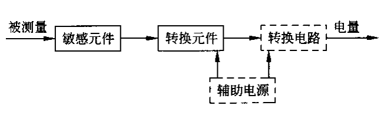
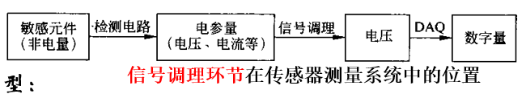
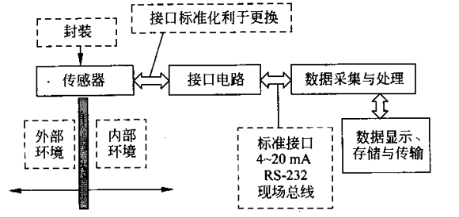
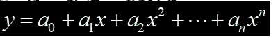
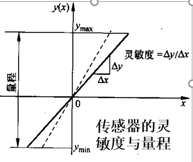
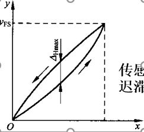
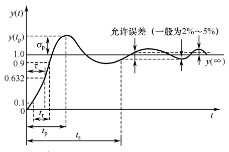
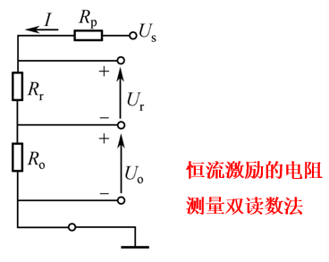

- [Chapter 5 传感器性能与电参数测量](#chapter-5-%e4%bc%a0%e6%84%9f%e5%99%a8%e6%80%a7%e8%83%bd%e4%b8%8e%e7%94%b5%e5%8f%82%e6%95%b0%e6%b5%8b%e9%87%8f)
  - [传感器基本概念](#%e4%bc%a0%e6%84%9f%e5%99%a8%e5%9f%ba%e6%9c%ac%e6%a6%82%e5%bf%b5)
    - [定义](#%e5%ae%9a%e4%b9%89)
    - [类型](#%e7%b1%bb%e5%9e%8b)
    - [组成](#%e7%bb%84%e6%88%90)
  - [信号调理与接口](#%e4%bf%a1%e5%8f%b7%e8%b0%83%e7%90%86%e4%b8%8e%e6%8e%a5%e5%8f%a3)
    - [信号调理](#%e4%bf%a1%e5%8f%b7%e8%b0%83%e7%90%86)
    - [接口](#%e6%8e%a5%e5%8f%a3)
  - [性能评价](#%e6%80%a7%e8%83%bd%e8%af%84%e4%bb%b7)
  - [静态特性](#%e9%9d%99%e6%80%81%e7%89%b9%e6%80%a7)
    - [评价指标](#%e8%af%84%e4%bb%b7%e6%8c%87%e6%a0%87)
  - [动态特性](#%e5%8a%a8%e6%80%81%e7%89%b9%e6%80%a7)
    - [时域响应和动态品质评价](#%e6%97%b6%e5%9f%9f%e5%93%8d%e5%ba%94%e5%92%8c%e5%8a%a8%e6%80%81%e5%93%81%e8%b4%a8%e8%af%84%e4%bb%b7)
  - [电参数测量](#%e7%94%b5%e5%8f%82%e6%95%b0%e6%b5%8b%e9%87%8f)
    - [电阻传感器](#%e7%94%b5%e9%98%bb%e4%bc%a0%e6%84%9f%e5%99%a8)
      - [电阻测量方法](#%e7%94%b5%e9%98%bb%e6%b5%8b%e9%87%8f%e6%96%b9%e6%b3%95)
    - [电容传感器](#%e7%94%b5%e5%ae%b9%e4%bc%a0%e6%84%9f%e5%99%a8)
      - [电容参数测量](#%e7%94%b5%e5%ae%b9%e5%8f%82%e6%95%b0%e6%b5%8b%e9%87%8f)
    - [电感传感器](#%e7%94%b5%e6%84%9f%e4%bc%a0%e6%84%9f%e5%99%a8)
      - [自感式传感器](#%e8%87%aa%e6%84%9f%e5%bc%8f%e4%bc%a0%e6%84%9f%e5%99%a8)
      - [互感式传感器](#%e4%ba%92%e6%84%9f%e5%bc%8f%e4%bc%a0%e6%84%9f%e5%99%a8)
      - [电感参数测量](#%e7%94%b5%e6%84%9f%e5%8f%82%e6%95%b0%e6%b5%8b%e9%87%8f)

# Chapter 5 传感器性能与电参数测量

## 传感器基本概念

### 定义

- 能感受被测量并按一定规律转换成可用信号的器件。最基本的组成元件：敏感元件和转换元件

### 类型

- 按基本效应
- 按构成原理
- 按能量转换原理
- 按输出信号的性质
- 按输入物理量
- 按工作原理
- 按测量方式

### 组成

- 敏感元件：**感知+输出**
- 转换原件：参量类型变换
- 转换电路：有用信号输出

## 信号调理与接口

### 信号调理

👉 作用

- **调理敏感/转换元件或传感器的输出信号**，使其更好地满足后续信号传输、处理或显示的要求

👉 所处位置

👉 主要类型

- 电平调整
- 线性化
- 信号形式变换
- 滤波
- 阻抗匹配

👉 主要实现方式

- 模拟电路

### 接口

- **系统模块化和输出标准化**的意义——不必深入了解各功能模块内部原理及结构，就可对整个系统进行设计、实现且便于维护

👉 接口定义

- 实现两功能模块间电气参数连接的部分
- 接口电路**可将信号从一个数域变换到另一个数域,如A/D转换**，也可将输出信号标准化

👉 数域

- 模拟数域的信息由**信号幅度**(如电压、电流)携载
- 时间数域的信息由**时间关系**(周期/频率、脉宽或相位)携载
- 数字数域的信息由**脉冲数**或**0/1编码串**携载

## 性能评价

👉 传感器的总特性

- 与被测对象和后接仪器装置的**输入、输出匹配**
- 机械特性
- 工作特性
  - 静态特性
  - 动态特性
  - 环境特性
- 误差

👉 传感器的标定

- 利用已知量输入到传感器，测量其相应输出量，进而得到**传感器输出-输入特性**的过程

👉 传感器的校准

- 传感器使用后的性能复测。**标定和校准本质相同**

👉 传感器的精度、精密度、不确定度

👉 传感器设计和选择三原则

- 整体需要原则
- 高可靠性原则
- 高性价比原则

- 精度
  - 测量值与真值的符合程度
- 精密度
  - 测量的重复程度
- 不确定度
  - 测量值位于一个区间

## 静态特性

👉 定义

- 传感器在被测量处于**稳定状态时的输出-输入静态函数**关系，表征其工作质量，由传感器内部结构参数决定

👉 输出-输入静态函数关系

- 利用**差动技术**，可以消除函数中的偶次非线性项
  - 差动技术：将两个相同特性的传感器差动组合

### 评价指标

1. 线性度(非线性误差)

    👉 表征传感器的校准曲线与拟合直线的偏差程度

    $$
        r_L = \pm \frac{\Delta L_{max}}{y_{FS}} \times 100\% \\
        \Delta L_{max}为最大偏差\\
        y_{FS}为满量程时的输出值
    $$

2. 灵敏度

    👉 传感器的输出增量与相应的输入增量之比

    

3. 迟滞

    👉 传感器对正向输入(输入增大)和反向输入(输入减小)的**实际响应特性曲线的不重合程度**

    

    - 迟滞环：正、反向特性曲线形成的闭环
    - 迟滞误差：为正反行程最大输出差值与满量程输出值之比

    $$
        r_H = \pm \frac{\Delta H_{max}}{y_{FS}} \times 100\%
    $$

4. 重复性

    👉 传感器在**同一工作条件下**，输入按同方向做连续多次变化时测得的多个特性曲线的**不重合程度**，为输出量最大不重复误差与满量程输出之比，反映数据的**离散程度**

    $$
        r_R = \pm \frac{\Delta R_{max}}{y_{FS}} \times 100\%
    $$

5. 分辨力

    👉 传感器能检测到的最小输入增量

6. 分辨率

    👉 分辨力与满量程输入之比

7. 阈值

    👉 当输入量小到某一值时，观察不到输出变化，这时的输入量称为传感器的**阈值**，它是传感器的**零位分辨力**

8. 稳定性

   - 零点温漂
   - 时间温漂
   - 灵敏度温漂

9. 综合误差

    👉 综合考虑线性度$\,r_L\,$，迟滞误差$\,r_H\,$，重复性误差$\,r_R\,$的综合值

👉 综上

- 量程，灵敏度，分辨力是衡量传感器**基本功能特性的指标**，决定其工作能力
- 线性度，重复性，迟滞，漂移，稳定性，综合误差是反映**精度特性的指标**，决定传感器在何种程度上能完成测量

## 动态特性

👉 定义

- 传感器对**随时间变化的输入量的响应特性**

👉 时间常数

- 时域内研究传感器对**标准**输入信号的响应特性

👉 保持幅值稳定的响应带宽

- 在频域内研究传感器对正弦输入的响应特性，包括**幅频特性**和**相频特性**

### 时域响应和动态品质评价

👉 时间响应特性与动态品质的关系

- 时间常数$\,\tau\,$——传感器输出值由零上升至稳定值的$\,63.2\%\,$所需要的时间
- 上升时间$\,t_r\,$——响应从最初稳态值的$\,5\%\,$或$\,10\%\,$上升，第一次达到稳态值的$\,90\%\,$或$\,95\%\,$需要的时间
- 响应时间$\,t_s\,$——输入量**开始起作用到输出进入规定的稳定值范围**的时间。
- 超调量$\,\sigma_p\,$——输出第一次**达到稳定值**又**超出稳定值**出现的最大偏差
- 峰值时间$\,t_p\,$——输出值由零上升超过稳定值，达到第一个峰值所需的时间

## 电参数测量

### 电阻传感器

👉 原理

- 被测量的变化转换成电阻值变化

#### 电阻测量方法

- 中、高阻值的测量常用**伏安法**
- 低阻值的测量需要能**克服被测电阻引线电阻和接触电阻的影响**的方法，如**4线制测量法**
- 超高阻值的测量常用**基于电容充电原理**的测量方法
- 高精度要求，需要考虑电源稳定性的影响

👉 一般方法

- 偏转法
  - 用恒压源供电测电阻电流
  - 用恒流源供电测电阻电压
- 双读数法
  - 先读固定电阻的端电压$\,U_r = IR_r\,$，再读串接的待测电阻端电压$\,U_o = IR_o\,$，计算可得$\,R_o = \frac{R_rU_o}{U_r}\,$
  - 
- 分压法
  - 用于**测阻值变化范围很大**的以及**非线性敏感**的电阻的检测方法
- 电桥法
  - 用于测量小的阻值变化

👉 总结

- 测电阻的一般方法
  - 偏差法
  - 分压法
  - 平衡电桥法
  - 不平衡电桥法
- 电阻测量中常见问题
  - 自热和引线电阻影响
  - 非线性
  - 电源电压波动影响
- 常见对策
  - 限制工作电流
  - 三线或四线电阻法
  - 降低灵敏度
  - 采用差动电桥
  - 借助A/D转换器进行比例测量

### 电容传感器

👉 电容量为

$$
  C = \frac{\varepsilon A}{d}
$$

👉 原理

- 改变上式中任何一个参数，都可使电容量改变，从而转换为测量某个参数

👉 作用形式

- 直接作用式
  - 传感器即电容变换器，不需要弹性元件，直接感受被测量
- 间接作用式
  - 电容传感器由弹性元件与电容变换器组成
  - 由敏感元件感受被测量，输出中间变量，电容变换器再将中间变量转换为电容变化输出

#### 电容参数测量

👉 转换为**电压、频率、脉宽**等变化来测量

👉 优缺点

- 优点
  - 电路和测法简单，便于实现高精度
- 缺点
  - 一般电容传感器的电容变化范围太小，检测电路的分辨率应达$\,fF\,$级，须**高灵敏度、低漂移**

👉 影响测量的因素

- 激励频率
  - 频率适中
- 激励信号
  - 常用方波
- 连接导线带来的寄生电容

👉 主要测量电路

- 振荡器式检测电路
- 电桥
- 充/放电式电路

### 电感传感器

👉 原理

- 利用被测量产生的**磁阻变化**使传感线圈的电感变化实现感测

👉 测量特点

- 测量方法属于间接式
  - 转换为**位移的非电量**
  - 测量能借助磁特性变化引起线圈电感变化的参量

#### 自感式传感器

👉 以位移传感器为例

- 变气隙型自感式传感器
- 气隙面积变化型自感式传感器
- 螺管型自感式传感器

#### 互感式传感器

👉 基本原理

- 电磁感应中的互感现象
- 实质是变压器

👉 以位移传感器为例

- 电涡流式传感器

#### 电感参数测量

👉 单线圈参数的测量

- 调幅式
- 调频式

👉 双线圈测量

- 差动整流电路
- 相敏检波电路