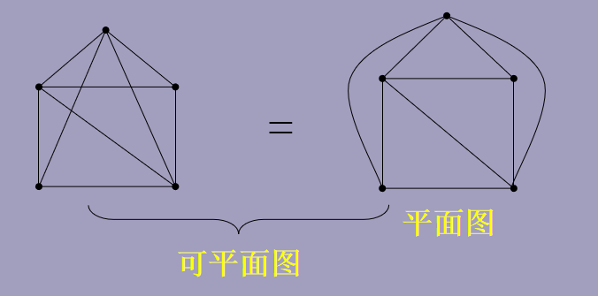

- [Graph_Theory](#graphtheory)
  - [最短路](#%e6%9c%80%e7%9f%ad%e8%b7%af)
    - [Dijkstra](#dijkstra)
    - [Floyd](#floyd)
  - [最小生成树](#%e6%9c%80%e5%b0%8f%e7%94%9f%e6%88%90%e6%a0%91)
    - [Kruskal](#kruskal)
    - [Prim](#prim)
  - [欧拉图和哈密顿图](#%e6%ac%a7%e6%8b%89%e5%9b%be%e5%92%8c%e5%93%88%e5%af%86%e9%a1%bf%e5%9b%be)
    - [欧拉图](#%e6%ac%a7%e6%8b%89%e5%9b%be)
    - [哈密顿图](#%e5%93%88%e5%af%86%e9%a1%bf%e5%9b%be)
      - [TSP问题](#tsp%e9%97%ae%e9%a2%98)
  - [着色 匹配 平面图](#%e7%9d%80%e8%89%b2-%e5%8c%b9%e9%85%8d-%e5%b9%b3%e9%9d%a2%e5%9b%be)
    - [顶点着色](#%e9%a1%b6%e7%82%b9%e7%9d%80%e8%89%b2)
      - [顶点着色算法](#%e9%a1%b6%e7%82%b9%e7%9d%80%e8%89%b2%e7%ae%97%e6%b3%95)
      - [边着色](#%e8%be%b9%e7%9d%80%e8%89%b2)
      - [边着色算法](#%e8%be%b9%e7%9d%80%e8%89%b2%e7%ae%97%e6%b3%95)
      - [应用 排课表问题](#%e5%ba%94%e7%94%a8-%e6%8e%92%e8%af%be%e8%a1%a8%e9%97%ae%e9%a2%98)
    - [匹配](#%e5%8c%b9%e9%85%8d)
      - [偶图](#%e5%81%b6%e5%9b%be)
      - [偶图的匹配](#%e5%81%b6%e5%9b%be%e7%9a%84%e5%8c%b9%e9%85%8d)
      - [应用 工作安排问题](#%e5%ba%94%e7%94%a8-%e5%b7%a5%e4%bd%9c%e5%ae%89%e6%8e%92%e9%97%ae%e9%a2%98)
      - [匈牙利算法——求偶图最大匹配](#%e5%8c%88%e7%89%99%e5%88%a9%e7%ae%97%e6%b3%95%e6%b1%82%e5%81%b6%e5%9b%be%e6%9c%80%e5%a4%a7%e5%8c%b9%e9%85%8d)
    - [平面图](#%e5%b9%b3%e9%9d%a2%e5%9b%be)
    - [网络流](#%e7%bd%91%e7%bb%9c%e6%b5%81)
      - [最小割和最大流](#%e6%9c%80%e5%b0%8f%e5%89%b2%e5%92%8c%e6%9c%80%e5%a4%a7%e6%b5%81)
      - [标号算法](#%e6%a0%87%e5%8f%b7%e7%ae%97%e6%b3%95)
      - [最小费用流](#%e6%9c%80%e5%b0%8f%e8%b4%b9%e7%94%a8%e6%b5%81)

# Graph_Theory

## 最短路

### Dijkstra

### Floyd

## 最小生成树

### Kruskal

### Prim

## 欧拉图和哈密顿图

### 欧拉图

👉 欧拉通路

通过图中每条边且只通过一次，且经过每一顶点的**通路**

- 判断无向图是否有欧拉通路

图连通且图中只有**0个或2个度**为奇数的结点

- 判断有向图是否有欧拉通路

图连通，除两个结点外其余结点的入度=出度(1个结点入度-出度=1，另一个相反)  或所有结点入度=出度

👉 欧拉回路

通过图中每条边且只通过一次，且经过每一顶点的**回路**

- 判断无向图是否有欧拉回路

图连通且图中**所有结点的度**均为偶数

- 判断有向图是否有欧拉回路

图连通，所有结点入度=出度

👉 欧拉图

具有欧拉回路的图称为欧拉图

### 哈密顿图

👉 哈密顿通路

经过每个顶点一次且仅一次的通路

👉 哈密顿回路

经过每个顶点一次且仅一次的回路

👉 哈密顿图

图中存在哈密顿回路

👉 判断条件

$G是有n个点的简单图，则对G的任意两个不相邻顶点u和v\,$

- G有哈密顿通路

$$
    d(u)+d(v) \geq n-1\quad i.e.d(u)表示顶点u的度
$$

- G是哈密顿图(即有哈密顿回路)

$$
    d(u) + d(v) \geq n
$$

$$
    若G是n(n\geq 3)阶无向简单图，若G的最小度\geq \frac{n}{2},则G是哈密顿图
$$

#### TSP问题

在赋权完全图G中求具有最小权之和的哈密顿回路，这个回路称为最优回路

## 着色 匹配 平面图

### 顶点着色

$$
    图G=(V,E),称映射\varphi:V\rightarrow \{1,2,\cdots,k\}为G的一个k-点着色。\\
    若G中任意两个相邻顶点u和v满足 \varphi(u) \neq \varphi(v),则着色是正常的.\\
    图G的正常k-着色的最小k值称为G的色数，记为\chi(G)
$$

👉 定理
$$
    对任意的图G均有\chi \neq \Delta + 1\quad \Delta是图的最大度
$$

#### 顶点着色算法

👉 Welsh-Powell

#### 边着色

#### 边着色算法

#### 应用 排课表问题

### 匹配

👉 定义
$$
    设M是图G的边子集，若\forall e \in M,e都不是环，且属于M的边互不相邻，则称M是G的一个匹配\\
    对v \in V(G),若v是M中某边的一个端点，则称v是M的饱和点，否则称为M的不饱和点
$$

👉 匹配分类

- 最大匹配——含边数最多的匹配
- 完美匹配——图中的点均为匹配的饱和点 的匹配

👉

- M交替路:G中由M中的边与非M中的边交替组成的路
- M可扩路：起点与终点均为M非饱和点的M交替路

#### 偶图

👉 定义
$$
    若图G的点集可以划分为两个互不相交的非空子集V_1,V_2(V_1 \bigcup V_2 = V)，使\forall e \in E,e的两端点分属于V_1,V_2,则称G是偶图
$$

👉 一个图是偶图当且仅当它不含长度为奇数的回路(奇圈)

#### 偶图的匹配

$$
    偶图G=(V_1,V_2,E),有下列必要或充分条件
$$

① Hall定理
$$
    G存在饱和V_1的每个点的匹配，当且仅当对任意S\subseteq V_1,有|N(S)|\geq |S|,\quad N(S)是S的邻集
$$

②
$$
    \exist t \in N, \forall v \in V_1 \Rightarrow d(v) \geq t,同时\forall u \in V_2,有d(u) \leq t ,则G存在饱和V_1的每个点的匹配
$$

③
$$
    若G为每个点的度数均为k的偶图，则G存在完美匹配
$$

④
$$
    若|V_1|>|V_2|,则不存在饱和V_1的每个点的匹配
$$

#### 应用 工作安排问题

#### 匈牙利算法——求偶图最大匹配

### 平面图

👉 定义

图G可画在一个平面上使**除顶点外**边不交叉，则称G是可嵌入平面

### 网络流

#### 最小割和最大流

#### 标号算法

#### 最小费用流
