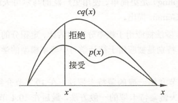
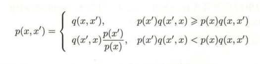
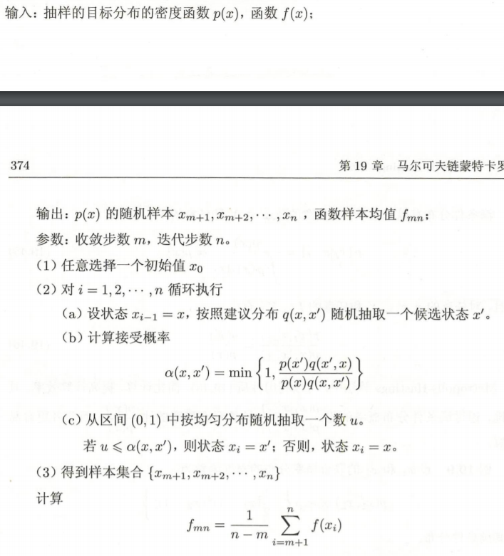
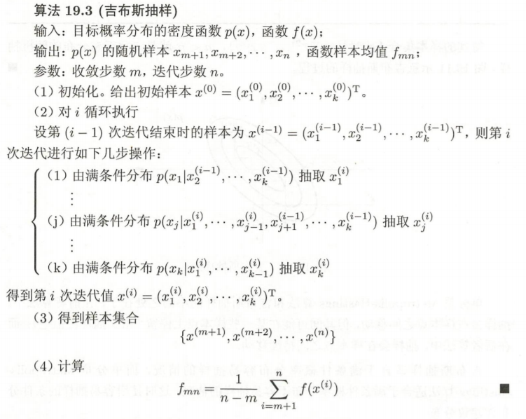

- [马尔可夫链蒙特卡洛法](#%e9%a9%ac%e5%b0%94%e5%8f%af%e5%a4%ab%e9%93%be%e8%92%99%e7%89%b9%e5%8d%a1%e6%b4%9b%e6%b3%95)
  - [蒙特卡洛法](#%e8%92%99%e7%89%b9%e5%8d%a1%e6%b4%9b%e6%b3%95)
    - [接受-拒绝抽样法](#%e6%8e%a5%e5%8f%97-%e6%8b%92%e7%bb%9d%e6%8a%bd%e6%a0%b7%e6%b3%95)
  - [马尔可夫链](#%e9%a9%ac%e5%b0%94%e5%8f%af%e5%a4%ab%e9%93%be)
    - [离散状态马氏链](#%e7%a6%bb%e6%95%a3%e7%8a%b6%e6%80%81%e9%a9%ac%e6%b0%8f%e9%93%be)
    - [连续状态马氏链](#%e8%bf%9e%e7%bb%ad%e7%8a%b6%e6%80%81%e9%a9%ac%e6%b0%8f%e9%93%be)
    - [马氏链性质](#%e9%a9%ac%e6%b0%8f%e9%93%be%e6%80%a7%e8%b4%a8)
  - [MCMC(马尔可夫链蒙特卡洛法)](#mcmc%e9%a9%ac%e5%b0%94%e5%8f%af%e5%a4%ab%e9%93%be%e8%92%99%e7%89%b9%e5%8d%a1%e6%b4%9b%e6%b3%95)
    - [基本思想](#%e5%9f%ba%e6%9c%ac%e6%80%9d%e6%83%b3)
    - [基本步骤](#%e5%9f%ba%e6%9c%ac%e6%ad%a5%e9%aa%a4)
    - [评价MCMC](#%e8%af%84%e4%bb%b7mcmc)
  - [Metropolis-Hastings算法](#metropolis-hastings%e7%ae%97%e6%b3%95)
    - [基本原理](#%e5%9f%ba%e6%9c%ac%e5%8e%9f%e7%90%86)
    - [算法流程](#%e7%ae%97%e6%b3%95%e6%b5%81%e7%a8%8b)
    - [单分量Metropolis-Hastings算法](#%e5%8d%95%e5%88%86%e9%87%8fmetropolis-hastings%e7%ae%97%e6%b3%95)
  - [Gibbs(吉布斯)抽样](#gibbs%e5%90%89%e5%b8%83%e6%96%af%e6%8a%bd%e6%a0%b7)
    - [Gibbs基本思想](#gibbs%e5%9f%ba%e6%9c%ac%e6%80%9d%e6%83%b3)
    - [Gibbs算法流程](#gibbs%e7%ae%97%e6%b3%95%e6%b5%81%e7%a8%8b)
    - [比较两种算法](#%e6%af%94%e8%be%83%e4%b8%a4%e7%a7%8d%e7%ae%97%e6%b3%95)

# 马尔可夫链蒙特卡洛法

👉 李航老师 《统计学习方法》笔记

## 蒙特卡洛法

👉 核心思想：**随机抽样**

👉 抽样方法

- 直接抽样
- 接受-拒绝抽样
- 重要性抽样([在RLlhy.md中AC部分](../../Computation_Intelligence/RL_lhy.md))
- 马尔科夫链蒙特卡洛法

  接受-拒绝抽样和重要性抽样方法适合**概率密度函数复杂,不能直接抽样**的情况

  马尔可夫链蒙特卡洛法适用于**概率密度函数复杂，👆抽样效率低**的情况，一般的蒙特卡洛法的抽样样本是独立的，但MCMC的抽样样本**不是独立的,样本序列形成马尔可夫链**

### 接受-拒绝抽样法

👉 思想

- $\,p(x)\,$不可直接抽样，找一个可以直接抽样的分布，称为**建议分布**$\,q(x)\,$
- 一定有$\,cq(x) > p(x),c>0\,$
- 按照$\,q(x)\,$抽样,得到样本$\,x^{*}\,$,按照$\,\frac{p(x^{*})}{cq(x^{*})}\,$的比例决定是否接受$\,x^{*}\,$

👉 优缺

- 优点
  - 容易实现
- 缺点
  - 效率不高
    - $\,p(x)\,$涵盖体积占$\,cq(x)\,$的涵盖体积比例很低，会导致拒绝的比例很高
    - 一般在高维空间抽样，即使$\,p(x)\,$与$\,cq(x)\,$很接近，两者涵盖体积的差异也可能很大

## 马尔可夫链

👉 定义

$$
  对于过程{X_t},某一时刻的随机变量X_t与前一个时刻的随机变量X_{t-1}之间有条件分布P(X_t|X_{t-1})\\
  如果X_t只依赖X_{t-1},而不依赖过去的随机变量,这一性质称为马尔科夫性\\
  具有马尔可夫性的过程称为马尔可夫链\\
  P(X_t|X_{t-1})称为马尔可夫链的转移概率分布
$$

👉 时间齐次的马尔可夫链

$$
  若转移概率分布与t无关,即P(X_{t+s}|X_{t+s-1}) =P(X_t|X_{t-1}) \\
  称为时间齐次的马尔可夫链(下文讨论的均为时间齐次的马氏链)
$$

- 👆定义的为一阶马尔可夫链,可以扩展到n阶。下文讨论的均为一阶,n阶可以转换为一阶

### 离散状态马氏链

👉 **转移概率**

$$
  马氏链在时刻(t-1)处于状态j,在时刻t移动到状态i\\
  转移概率记为p_{ij}= P(X_t=i|X_{t-1}=j)\\
  显然满足p_{ij} \geq 0,\sum_{i} p_{ij}=1
$$

👉 **转移概率矩阵**

$$
  显然转移概率组成一个矩阵,称为马氏链的转移概率矩阵
$$

👉 **状态分布**

$$
  马氏链在时刻t的概率分布,称为时刻t的状态分布\\
  \pi(t) = \begin{bmatrix}
    \pi_1(t)\\
    \pi_2(t)\\
    \vdots
  \end{bmatrix}\\
  \pi_i(t)=P(X_t= i),表示时刻t状态为i的概率
$$

- 马氏链的初始分布$\,\pi(0)\,$向量通常只有一个分量是1,其余分量都是0,表示马尔可夫链从一个具体状态开始

- 马氏链在t时刻的状态分布,可由**时刻(t-1)的状态分布以及转移概率矩阵确定**

$$
\pi(t) = P\pi(t-1)\\
P是转移概率矩阵\\
可以递推得到\pi(t) = P^t\pi(0)\\
P^t称为t步转移概率矩阵\\
👆说明,马氏链的状态分布由初始分布和转移概率分布决定
$$

$\,\pi(t) = P\pi(t-1)\,$的证明👇
$$
  \begin{aligned}
    \pi_i(t) &= P(X_t=i)\\
    &= \sum_{m} P(X_t=i|X_{t-1}=m)P(X_{t-1}=m)\\
    &= \sum_{m} p_{im}\pi_{m}(t-1)
  \end{aligned}
$$

👉 **平稳分布**

$$
  若在状态空间S存在一个分布\pi\\
  \pi = \begin{bmatrix}
    \pi_1\\
    \pi_2\\
    \vdots
  \end{bmatrix}\\
  使得\pi=P\pi\\
  称\pi是马氏链的平稳分布\\
  对于每一时刻的分布都是相同的
$$

- 状态空间是指随机变量取值的集合(每个随机变量取值的集合相同)
- 显然,若马氏链存在平稳分布,则以该**平稳分布为初始分布,向未来进行随机状态转移,之后的任意时刻的状态分布都是平稳分布**

- 求解平稳分布可以用此引理

$$
  \pi=(\pi_1,\pi_2,\cdots)^T是马氏链的平稳分布的充要条件是\\
  \pi是👇方程组的解\\
  \begin{cases}
    x_i= \sum_{j}p_{ij}x_j\quad (其实就是\pi=P\pi)\\
    x_i \geq 0\\
    \sum_{i} x_i = 1
  \end{cases}
$$

- 注意,马氏链的平稳分布不唯一

### 连续状态马氏链

👉 转移概率

- 由**概率转移核**$\,P(x,A)\,$表示

$$
  设S是连续状态空间,\forall x \in S,A\subset S\\
  P(x,A) = \int_A p(x,y)dy
$$

- 其中$\,p(x,·)\,$是概率密度函数。转移核表示从$\,x\sim A\,$的转移概率

$$
  P(x,A) = P(X_t = A | X_{t-1} = x)
$$

- 有时也直接将概率密度函数称为转移核

👉 平稳分布

$$
  \pi(y) = \int p(x,y)\pi(x)dx, \forall y \in S\\
  则称\pi(x)为马氏链的平稳分布
$$

### 马氏链性质

- 👇介绍的是离散马氏链,可以推广到连续马氏链

👉 **不可约**

$$
  \forall i,j \in S,如果\exist t \in T,满足\\
  P(X_t = i | X_0 = j) > 0\\
  则称此马氏链是不可约的,反之则为可约的 
$$

- 👆意为——对于一个不可约的马氏链,从任意状态出发,经过充分长时间后,可以到达任意状态

👉 **非周期**

$$
  \forall i \in S,如果时刻0从状态i出发\\
  t时刻返回状态i的所有时长\{t|P(X_t=i|X_0=i)>0\}的最大公约数为1(即互素)\\
  则称该马氏链是非周期的,反之则为周期的
$$

👉 **定理**

- **不可约**且**非周期**的**有限状态**马氏链,有唯一平稳分布存在

👉 **正常返**

$$
  \forall i,j \in S,定义p_{ij}^t为时刻0从状态j出发,时刻t首次转移到状态i的概率\\
  若\lim_{t \rightarrow \infty} p_{ij}^t >0\\
  称该马氏链是正常返的
$$

👉 **定理**

- **不可约**且**非周期**且**正常返**的马氏链,有唯一平稳分布存在

👉 **遍历定理**

$$
  若马氏链X是不可约、非周期且正常返的\\
  转移概率的极限分布是马氏链的平稳分布\\
  \lim_{t \rightarrow \infty} P(X_t=i|X_0=j) = \pi(i)\\
  若f(X)是定义在S上的函数,且有E_{\pi}[|f(X)|] <\infty,则\\
  P\{\hat{f_t} \rightarrow E_{\pi}[|f(X)|]\}=1\quad 这里的\hat{f_t} = \frac{1}{t} \sum_{s=1}^{t} f(x_s)
$$

- 👆解释
- 当时间趋于无穷时,满足要求的马氏链的状态分布趋近于平稳分布
- 如👆,随机变量函数的样本均值**依概率1收敛于函数的期望**
- 样本均值可以认为是**时间均值**,函数的期望是**空间均值**,故遍历性的含义为——当时间趋于无穷时,时间均值等于空间均值
- 遍历定理的三个约束条件,**保证了当时间趋于无穷时,达到任意一个状态的概率不为0**

- 在实际操作时,可以**取一个足够大的整数m**,经过m次迭代后认为状态分布为平稳分布,用第m+1次迭代到第n次迭代的时间均值作为函数期望的估计值

$$
  \hat{E}_{f} = \frac{1}{n-m} \sum_{i=m+1}^{n} f(x_i)
$$

- 👆估计值称为**遍历均值**

👉 **可逆马氏链**

$$
  马氏链X,若有状态分布\pi,\forall i,j \in S,t\in T,有\\
  p_{ij}\pi_j = p_{ji}\pi_i\\
  则该马氏链为可逆马氏链,👆称为细致平衡方程
$$

👉 **定理**

- 满足细致平衡方程的状态分布一定是马氏链的**平稳分布**
- 该定理说明**可逆马氏链一定有唯一平稳分布**,即可逆马氏链满足**不可约 非周期 正常返**

## MCMC(马尔可夫链蒙特卡洛法)

👉 目标是对一个概率分布进行随机抽样,及求函数关于该概率分布的数学期望

👉 MCMC更适合的情况

- 随机变量是多元的
- 概率密度函数复杂
- 随机变量各分量不独立

### 基本思想

- 在随机变量的状态空间定义一个满足**遍历定理**的马氏链
- 使其平稳分布就是**抽样的目标分布**$\,p(x)\,$
- 在马氏链进行随机游走,每个时刻得到一个样本
- 由遍历定理,当时间趋于无穷,样本的分布趋于平稳分布,样本的均值趋于函数的数学期望
- 故👆说过,当时间足够长时(t>m,m足够大),之后的时间($\,m<t<n\,$)得到的样本集合即为$\,p(x)\,$的抽样结果,得到的遍历均值即为函数的期望
- 到m为止的时间段称为**燃烧期**

- 显然,构造满足条件的马氏链是关键
  - 一个方法是定义特殊的转移概率矩阵(对于连续马氏链则为转移核函数),构建**可逆马氏链**——可以保证遍历定理的成立
  - 常用方法有
    - Metropolis-Hastings算法
    - 吉布斯抽样
- MCMC的收敛性判断通常是经验性的
  - 如,每隔一段时间取一次样本,得到多个样本后计算遍历均值,当均值稳定后,可以认为马氏链已经收敛
  - 再如,在马氏链上并行多个随机游走,比较各个随机游走遍历均值是否接近一致。
- MCMC法得到的样本序列,相邻的样本点是**相关的**,而不是独立的
  - 若需要独立样本,可以在样本序列再次随机抽样,这样得到的子样本集合为独立样本集合
- 由于此马氏链满足遍历定理,随机游走的起始点并不影响得到的结果,都会收敛到同一平稳分布

### 基本步骤

- 定义马氏链,满足遍历定理且其平稳分布为目标分布
- 从状态空间的某一点出发,进行随机游走,得到样本序列
- 确定正整数m,n,得到样本集合$\,\{x_{m+1},x_{m+2},\cdots,x_{n}\}\,$,求得函数的遍历均值

👉 **重要问题**

- 如何定义马氏链,满足条件
- 如何确定收敛步数,保证样本抽样的无偏性
- 如何确定迭代步数,保证遍历均值计算的精度

### 评价MCMC

- 比接受-拒绝法更容易实现,只需要定义马氏链,而不需要定义建议分布
- 效率比接受-拒绝法更高
- 在贝叶斯学习中,有重要的作用

## Metropolis-Hastings算法

### 基本原理

👉 **马尔可夫链**

- 采用转移核为$\,p(x,x^{'})\,$的马氏链

$$
  p(x,x^{'}) = q(x,x^{'})\alpha(x,x^{'})
$$

- 建议分布$\,q(x,x^{'})\,$是另一个马氏链的转移核,且是不可约的,**同时是一个容易抽样的分布**
- 接受分布$\,\alpha(x,x^{'})\,$为

$$
  \alpha(x,x^{'}) = min\{1,\frac{p(x^{'})q(x^{'},x)}{p(x)q(x,x^{'})}\}
$$

- 转移核可以写为下式 

- 转移核为$\,p(x,x^{'})\,$的马尔可夫链上随机游走按以下方式进行
  - 若在时刻$\,t-1\,$处于状态$\,x,即x_{t-1}=x\,$,先按建议分布$\,q(x,x^{'})\,$抽样产生一个候选状态$\,x^{'}\,$
  - 按照接受分布$\,\alpha(x,x^{'})\,$抽样决定是否接受$\,x^{'}\,$.以概率$\,\alpha(x,x^{'})\,$接受$\,x^{'}\,$,以概率$\,1-\alpha(x,x^{'})\,$接受$\,x^{'}\,$
- 可以证明,以转移核为$\,p(x,x^{'})\,$的马氏链是**可逆马氏链**,其平稳分布就是$\,p(x)\,$,故是MCMC的一个实现

👉 **建议分布**

- 👇是两种常用形式

- 第一种形式,建议分布是**对称的**.$\,q(x,x^{'}) = q(x^{'},x)\,$这样的建议分布称为**Metropolis选择**
  - 这是接受分布简化为$\,\alpha(x,x^{'})=min\{1,\frac{p(x^{'})}{p(x)}\}\,$
  - Metropolis选择的特点是当$\,x^{'}\,$与$\,x\,$比较接近时,$\,q(x,x^{'})\,$的概率值高。即状态庄毅在附近点的可能性更大
- 第二种形式称为**独立抽样**
  - 假设$\,q(x,x^{'})\,$与当前状态$\,x\,$无关,即$\,q(x,x^{'})=q(x^{'})\,$。建议分布按照$\,q(x^{'})\,$独立抽样进行
  - 接受分布简化为$\,\alpha(x,x^{'})=min\{1,\frac{w(x^{'})}{w(x)}\}\,$,$\,w(x)=p(x)/q(x)\,$

👉 **满条件分布**

- 定义:
  - MCMC法的目标分布通常是**多元联合概率分布**$\,p(x)=p(x_1,x_2,\cdots,x_k)\,$
  - 如果条件概率分布$\,p(x_I|x_{-I})\,$中所有$\,k\,$个变量全部出现($\,x_I=\{x_i,i\in I,x_{-I}= {x_i,i\notin I}\},I\subset K\,$),称此条件概率分布为**满条件分布**
- 性质
  - $\,p(x_I|x_{-I})与p(x)成正比\,$
  - $\,\frac{p(x^{'}_{I}|x^{'}_{-I})}{p(x_{I}|x_{-I})} = \frac{p(x^{'})}{p(x)}\,$
- 利用第二条性质,可以简化计算接受分布的计算。**满条件分布概率的比**相对于**联合概率的比**更好算

### 算法流程

### 单分量Metropolis-Hastings算法

👉 对多元变量分布的抽样是困难的,故对多元变量的每一变量的条件分布依次分别抽样,完成对整个多元变量的一次抽样

[单分量Metropolis-Hastings_1](captures/单分量Metropolis-Hastings_1.PNG "单分量Metropolis-Hastings_1")

[单分量Metropolis-Hastings_2](captures/单分量Metropolis-Hastings_2.PNG "单分量Metropolis-Hastings_2")

## Gibbs(吉布斯)抽样

### Gibbs基本思想

- 从联合概率分布定义满条件概率分布,依次对满条件概率分布进行抽样,得到样本序列
- 可以证明这样的抽样过程是一个在马氏链上的**随机游走,每一个样本对应马氏链的状态,平稳分布就是目标的联合分布,即为MCMC的一个实现
- 与单分量Metropolis-Hastings不同,Gibbs对每次抽样结果都接受

### Gibbs算法流程

### 比较两种算法

- Gibbs适合**满条件分布概率容易抽样的情况**
- 单分量Metropolis-Hastings适合**满条件概率分布不容易抽样的情况**