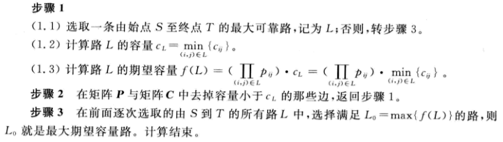

- [Matlab图论](#matlab%e5%9b%be%e8%ae%ba)
  - [基础](#%e5%9f%ba%e7%a1%80)
    - [图的矩阵表示](#%e5%9b%be%e7%9a%84%e7%9f%a9%e9%98%b5%e8%a1%a8%e7%a4%ba)
      - [邻接矩阵A](#%e9%82%bb%e6%8e%a5%e7%9f%a9%e9%98%b5a)
      - [关联矩阵M](#%e5%85%b3%e8%81%94%e7%9f%a9%e9%98%b5m)
    - [基本定理](#%e5%9f%ba%e6%9c%ac%e5%ae%9a%e7%90%86)
    - [计算有向图的可达矩阵](#%e8%ae%a1%e7%ae%97%e6%9c%89%e5%90%91%e5%9b%be%e7%9a%84%e5%8f%af%e8%be%be%e7%9f%a9%e9%98%b5)
    - [关联矩阵和邻接矩阵的转换](#%e5%85%b3%e8%81%94%e7%9f%a9%e9%98%b5%e5%92%8c%e9%82%bb%e6%8e%a5%e7%9f%a9%e9%98%b5%e7%9a%84%e8%bd%ac%e6%8d%a2)
  - [最短路](#%e6%9c%80%e7%9f%ad%e8%b7%af)
    - [最短距离矩阵](#%e6%9c%80%e7%9f%ad%e8%b7%9d%e7%a6%bb%e7%9f%a9%e9%98%b5)
    - [Dijsktra算法](#dijsktra%e7%ae%97%e6%b3%95)
    - [Floyd算法](#floyd%e7%ae%97%e6%b3%95)
    - [最大可靠路](#%e6%9c%80%e5%a4%a7%e5%8f%af%e9%9d%a0%e8%b7%af)
    - [最大期望容量路](#%e6%9c%80%e5%a4%a7%e6%9c%9f%e6%9c%9b%e5%ae%b9%e9%87%8f%e8%b7%af)
  - [树](#%e6%a0%91)
    - [哈夫曼树](#%e5%93%88%e5%a4%ab%e6%9b%bc%e6%a0%91)
    - [最小生成树](#%e6%9c%80%e5%b0%8f%e7%94%9f%e6%88%90%e6%a0%91)
      - [Kruskal](#kruskal)
      - [Prim](#prim)
  - [欧拉图 哈密尔顿图](#%e6%ac%a7%e6%8b%89%e5%9b%be-%e5%93%88%e5%af%86%e5%b0%94%e9%a1%bf%e5%9b%be)
    - [欧拉图](#%e6%ac%a7%e6%8b%89%e5%9b%be)
    - [哈密尔顿图](#%e5%93%88%e5%af%86%e5%b0%94%e9%a1%bf%e5%9b%be)
  - [匹配问题](#%e5%8c%b9%e9%85%8d%e9%97%ae%e9%a2%98)
    - [理论](#%e7%90%86%e8%ae%ba)
    - [最大匹配问题——匈牙利算法](#%e6%9c%80%e5%a4%a7%e5%8c%b9%e9%85%8d%e9%97%ae%e9%a2%98%e5%8c%88%e7%89%99%e5%88%a9%e7%ae%97%e6%b3%95)
    - [最优分配问题——KM算法](#%e6%9c%80%e4%bc%98%e5%88%86%e9%85%8d%e9%97%ae%e9%a2%98km%e7%ae%97%e6%b3%95)
  - [网络流](#%e7%bd%91%e7%bb%9c%e6%b5%81)
    - [最大流问题](#%e6%9c%80%e5%a4%a7%e6%b5%81%e9%97%ae%e9%a2%98)
      - [Ford-Fulkson标号算法](#ford-fulkson%e6%a0%87%e5%8f%b7%e7%ae%97%e6%b3%95)
      - [Dinic算法](#dinic%e7%ae%97%e6%b3%95)
    - [最小费用流](#%e6%9c%80%e5%b0%8f%e8%b4%b9%e7%94%a8%e6%b5%81)
      - [Busacker-Gowan迭代算法](#busacker-gowan%e8%bf%ad%e4%bb%a3%e7%ae%97%e6%b3%95)
  - [染色](#%e6%9f%93%e8%89%b2)
    - [顶点染色](#%e9%a1%b6%e7%82%b9%e6%9f%93%e8%89%b2)
      - [贮藏问题](#%e8%b4%ae%e8%97%8f%e9%97%ae%e9%a2%98)
    - [边染色](#%e8%be%b9%e6%9f%93%e8%89%b2)
      - [排课表问题](#%e6%8e%92%e8%af%be%e8%a1%a8%e9%97%ae%e9%a2%98)

# Matlab图论

👉 来自《图论算法及其MATLAB实现》此书

## 基础

### 图的矩阵表示

#### 邻接矩阵A

👉 $\,对于无向图G=(V,E),a_{ij}表示顶点v_i和顶点v_j之间的边数\,$

👉 邻接矩阵$\,A(G)\,$的性质

- $A(G)是对称矩阵$
- $若G是无环图，A(G)中第i行(列)的元素之和等于顶点v_i的度数$

👉 $\,有向图D的邻接矩阵A(D),a_{ij}表示从始点v_i到终点v_j的有向边条数\,$

#### 关联矩阵M

👉 $\,对于无向图G=(V,E),m_{ij}表示顶点v_i与边e_j关联的次数\,$

👉 $\,有向图的关联矩阵M(D),若v_i是有向边a_j的始点,则m_{ij}=1;若v_i是有向边a_j的终点,则m_{ij}=-1;若v_i是有向边a_j的不关联点,则m_{ij}=0\,$

### 基本定理

👉 握手定理

- $\sum_{v\in V} d(v) = 2|E|,即所有顶点的度之和等于2倍边数$
- $\,在任何图中，奇点的个数为偶数(奇点是度数为奇数的顶点)\,$
- $\,对任意有向图D=(V,A),有\sum_{u\in V(D)} d_D^{+}(u) = \sum_{u\in V(D)} d_D^{-}(u) = | A|,即出度之和等于入度之和等于边数\,$

### 计算有向图的可达矩阵

👉 定义矩阵$\,P=(p_{ij})_{n\times n}\,$

- $$
    p_{ij} = \begin{cases}
        0,&v_i到v_j不可达\\
        1,&v_i到v_j可达
    \end{cases}
$$

👉 计算方法

- $$
    B_n = A  + A^2 + \cdots + A^n\\
    将B_n中不为0的元素改为1，为0的元素不变，即可得到可达矩阵(A为邻接矩阵)
$$

### 关联矩阵和邻接矩阵的转换

👉 见代码

## 最短路

### 最短距离矩阵

👉 思想与floyd算法一样

### Dijsktra算法

👉 在python中用到了优先队列 比较好解决 在matlab中是根据算法的流程编写

### Floyd算法

### 最大可靠路

👉 对于指定的始点和终点，找到一条路，使该路径上总完好概率(**完好概率的乘积**)极大

### 最大期望容量路

👉 对于指定的始点和终点，使这条路最大通过能力(由容量最小的边决定)和该路径的总完好概率的乘积极大

👉 算法流程

## 树

### 哈夫曼树

👉 见 数据结构算法 “二叉树与树”

### 最小生成树

#### Kruskal

#### Prim

## 欧拉图 哈密尔顿图

👉 中国邮递员和旅行售货员(TSP)的问题都可以抽象为**图中的环游问题**，前者的本质是**图的所有边的环游**(类似于欧拉图)，后者的本质是**图的所有顶点的环游**(类似于哈密尔顿图)

### 欧拉图

👉 求欧拉图中的欧拉回路——[**Fleury算法**](http://www.voidcn.com/article/p-vjroqdmg-sy.html)

### 哈密尔顿图

👉 改良圈算法

👉 智能算法

## 匹配问题

### 理论

👉 二分图(偶图)

- $\,G=(V,E),V分为两个非空子集X和Y,并且每条边都有一个顶点在X中,另一个顶点在Y中，称此图为二分图或偶图\,$
- $\,若X的每个顶点都与Y的每个顶点相连,则称为完全二分图或完全偶图。若|X|=m,|Y|=n,则称此图为K_{m,n}\,$

👉 匹配

- $\,M是E的子集，若M中任何两边都不邻接，则称M为G的一个匹配\,$
- $\,匹配M中边元素个数称为匹配的基数\,$
- $\,匹配M中边的端点称为M-饱和点，其他顶点称为M-未饱和点。\,$
- $\,若G中的每个顶点都是M-饱和点，则称M为G的完美匹配。\,$
- $\,若G中不存在另一个匹配|M^{'}|,使得|M^{'}|>|M|,则称M是最大匹配，|M|称为\,$

### 最大匹配问题——匈牙利算法

👉 [解决人员分配问题](https://www.mathworks.com/matlabcentral/fileexchange/6543-functions-for-the-rectangular-assignment-problem)

### 最优分配问题——KM算法

👉 [B乎详细介绍](https://zhuanlan.zhihu.com/p/62981901)

## 网络流

### 最大流问题

#### Ford-Fulkson标号算法

[算法代码](https://www.sanfoundry.com/java-program-implement-ford-fulkerson-algorithm/)

#### Dinic算法

### 最小费用流

#### Busacker-Gowan迭代算法

## 染色

### 顶点染色

#### 贮藏问题

### 边染色

#### 排课表问题