- [Time_Series_Analysis](#timeseriesanalysis)
  - [Chapter 1 时间序列](#chapter-1-%e6%97%b6%e9%97%b4%e5%ba%8f%e5%88%97)
    - [1.2 平稳序列](#12-%e5%b9%b3%e7%a8%b3%e5%ba%8f%e5%88%97)
    - [1.3 时间序列的平稳化预处理](#13-%e6%97%b6%e9%97%b4%e5%ba%8f%e5%88%97%e7%9a%84%e5%b9%b3%e7%a8%b3%e5%8c%96%e9%a2%84%e5%a4%84%e7%90%86)
    - [1.4 推移算子及数据预处理](#14-%e6%8e%a8%e7%a7%bb%e7%ae%97%e5%ad%90%e5%8f%8a%e6%95%b0%e6%8d%ae%e9%a2%84%e5%a4%84%e7%90%86)
  - [Chapter 2 线性平稳过程](#chapter-2-%e7%ba%bf%e6%80%a7%e5%b9%b3%e7%a8%b3%e8%bf%87%e7%a8%8b)
    - [2.1 一般线性过程](#21-%e4%b8%80%e8%88%ac%e7%ba%bf%e6%80%a7%e8%bf%87%e7%a8%8b)
      - [白噪声](#%e7%99%bd%e5%99%aa%e5%a3%b0)
      - [线性过程的两种等价形式](#%e7%ba%bf%e6%80%a7%e8%bf%87%e7%a8%8b%e7%9a%84%e4%b8%a4%e7%a7%8d%e7%ad%89%e4%bb%b7%e5%bd%a2%e5%bc%8f)
      - [线性过程的均值函数与自协方差函数](#%e7%ba%bf%e6%80%a7%e8%bf%87%e7%a8%8b%e7%9a%84%e5%9d%87%e5%80%bc%e5%87%bd%e6%95%b0%e4%b8%8e%e8%87%aa%e5%8d%8f%e6%96%b9%e5%b7%ae%e5%87%bd%e6%95%b0)
      - [线性过程的平稳过程](#%e7%ba%bf%e6%80%a7%e8%bf%87%e7%a8%8b%e7%9a%84%e5%b9%b3%e7%a8%b3%e8%bf%87%e7%a8%8b)
      - [线性过程的可逆性条件](#%e7%ba%bf%e6%80%a7%e8%bf%87%e7%a8%8b%e7%9a%84%e5%8f%af%e9%80%86%e6%80%a7%e6%9d%a1%e4%bb%b6)
    - [2.2 平稳序列的线性数学模型](#22-%e5%b9%b3%e7%a8%b3%e5%ba%8f%e5%88%97%e7%9a%84%e7%ba%bf%e6%80%a7%e6%95%b0%e5%ad%a6%e6%a8%a1%e5%9e%8b)
      - [常系数齐次线性差分方程](#%e5%b8%b8%e7%b3%bb%e6%95%b0%e9%bd%90%e6%ac%a1%e7%ba%bf%e6%80%a7%e5%b7%ae%e5%88%86%e6%96%b9%e7%a8%8b)
      - [非齐次差分方程](#%e9%9d%9e%e9%bd%90%e6%ac%a1%e5%b7%ae%e5%88%86%e6%96%b9%e7%a8%8b)
      - [平稳时间序列的线性数学模型](#%e5%b9%b3%e7%a8%b3%e6%97%b6%e9%97%b4%e5%ba%8f%e5%88%97%e7%9a%84%e7%ba%bf%e6%80%a7%e6%95%b0%e5%ad%a6%e6%a8%a1%e5%9e%8b)
    - [2.3 ARMA序列的因果可逆性](#23-arma%e5%ba%8f%e5%88%97%e7%9a%84%e5%9b%a0%e6%9e%9c%e5%8f%af%e9%80%86%e6%80%a7)
      - [ARMA模型平稳解的存在唯一性](#arma%e6%a8%a1%e5%9e%8b%e5%b9%b3%e7%a8%b3%e8%a7%a3%e7%9a%84%e5%ad%98%e5%9c%a8%e5%94%af%e4%b8%80%e6%80%a7)
      - [ARMA序列的因果性](#arma%e5%ba%8f%e5%88%97%e7%9a%84%e5%9b%a0%e6%9e%9c%e6%80%a7)
      - [ARMA序列的可逆性](#arma%e5%ba%8f%e5%88%97%e7%9a%84%e5%8f%af%e9%80%86%e6%80%a7)
    - [2.4 ARMA模型的平稳域和可逆域](#24-arma%e6%a8%a1%e5%9e%8b%e7%9a%84%e5%b9%b3%e7%a8%b3%e5%9f%9f%e5%92%8c%e5%8f%af%e9%80%86%e5%9f%9f)
  - [Chapter 3 平稳序列的数字特征及其估计](#chapter-3-%e5%b9%b3%e7%a8%b3%e5%ba%8f%e5%88%97%e7%9a%84%e6%95%b0%e5%ad%97%e7%89%b9%e5%be%81%e5%8f%8a%e5%85%b6%e4%bc%b0%e8%ae%a1)
    - [3.1 平稳序列的均值及估计](#31-%e5%b9%b3%e7%a8%b3%e5%ba%8f%e5%88%97%e7%9a%84%e5%9d%87%e5%80%bc%e5%8f%8a%e4%bc%b0%e8%ae%a1)
      - [能否用一条现实求得$\,m_t\,$的良好估计](#%e8%83%bd%e5%90%a6%e7%94%a8%e4%b8%80%e6%9d%a1%e7%8e%b0%e5%ae%9e%e6%b1%82%e5%be%97math-xmlns%22httpwwww3org1998mathmathml%22semanticsmrowmtext-mtextmsubmimmimitmimsubmtext-mtextmrowannotation-encoding%22applicationx-tex%22mtannotationsemanticsmathmt%e2%80%8b%e7%9a%84%e8%89%af%e5%a5%bd%e4%bc%b0%e8%ae%a1)
      - [估计量的统计性质](#%e4%bc%b0%e8%ae%a1%e9%87%8f%e7%9a%84%e7%bb%9f%e8%ae%a1%e6%80%a7%e8%b4%a8)
      - [估计量的渐进分布](#%e4%bc%b0%e8%ae%a1%e9%87%8f%e7%9a%84%e6%b8%90%e8%bf%9b%e5%88%86%e5%b8%83)
      - [样本长度](#%e6%a0%b7%e6%9c%ac%e9%95%bf%e5%ba%a6)
    - [3.2 ARMA序列自协方差函数及计算](#32-arma%e5%ba%8f%e5%88%97%e8%87%aa%e5%8d%8f%e6%96%b9%e5%b7%ae%e5%87%bd%e6%95%b0%e5%8f%8a%e8%ae%a1%e7%ae%97)
      - [自协方差函数回顾](#%e8%87%aa%e5%8d%8f%e6%96%b9%e5%b7%ae%e5%87%bd%e6%95%b0%e5%9b%9e%e9%a1%be)
      - [ARMA(p,q)的自协方差函数](#armapq%e7%9a%84%e8%87%aa%e5%8d%8f%e6%96%b9%e5%b7%ae%e5%87%bd%e6%95%b0)
      - [MA(q)的自协方差函数](#maq%e7%9a%84%e8%87%aa%e5%8d%8f%e6%96%b9%e5%b7%ae%e5%87%bd%e6%95%b0)
      - [AR(p)的自协方差函数](#arp%e7%9a%84%e8%87%aa%e5%8d%8f%e6%96%b9%e5%b7%ae%e5%87%bd%e6%95%b0)
      - [自协方差函数的允许域](#%e8%87%aa%e5%8d%8f%e6%96%b9%e5%b7%ae%e5%87%bd%e6%95%b0%e7%9a%84%e5%85%81%e8%ae%b8%e5%9f%9f)
    - [3.3 自协方差函数的估计](#33-%e8%87%aa%e5%8d%8f%e6%96%b9%e5%b7%ae%e5%87%bd%e6%95%b0%e7%9a%84%e4%bc%b0%e8%ae%a1)
      - [自协方差函数估计量](#%e8%87%aa%e5%8d%8f%e6%96%b9%e5%b7%ae%e5%87%bd%e6%95%b0%e4%bc%b0%e8%ae%a1%e9%87%8f)
      - [估计量的优良性](#%e4%bc%b0%e8%ae%a1%e9%87%8f%e7%9a%84%e4%bc%98%e8%89%af%e6%80%a7)
      - [估计量的渐进分布(为啥会有重复标题2333)](#%e4%bc%b0%e8%ae%a1%e9%87%8f%e7%9a%84%e6%b8%90%e8%bf%9b%e5%88%86%e5%b8%83%e4%b8%ba%e5%95%a5%e4%bc%9a%e6%9c%89%e9%87%8d%e5%a4%8d%e6%a0%87%e9%a2%982333)
    - [3.4 ARMA序列的偏相关函数](#34-arma%e5%ba%8f%e5%88%97%e7%9a%84%e5%81%8f%e7%9b%b8%e5%85%b3%e5%87%bd%e6%95%b0)
      - [偏相关函数定义](#%e5%81%8f%e7%9b%b8%e5%85%b3%e5%87%bd%e6%95%b0%e5%ae%9a%e4%b9%89)
      - [预报系数的直接算法](#%e9%a2%84%e6%8a%a5%e7%b3%bb%e6%95%b0%e7%9a%84%e7%9b%b4%e6%8e%a5%e7%ae%97%e6%b3%95)
      - [预报系数的递推算法](#%e9%a2%84%e6%8a%a5%e7%b3%bb%e6%95%b0%e7%9a%84%e9%80%92%e6%8e%a8%e7%ae%97%e6%b3%95)
      - [AR(p)序列偏相关函数的截尾性](#arp%e5%ba%8f%e5%88%97%e5%81%8f%e7%9b%b8%e5%85%b3%e5%87%bd%e6%95%b0%e7%9a%84%e6%88%aa%e5%b0%be%e6%80%a7)
      - [MA，ARMA序列偏相关函数的拖尾性](#maarma%e5%ba%8f%e5%88%97%e5%81%8f%e7%9b%b8%e5%85%b3%e5%87%bd%e6%95%b0%e7%9a%84%e6%8b%96%e5%b0%be%e6%80%a7)
      - [时间序列分类性质总结](#%e6%97%b6%e9%97%b4%e5%ba%8f%e5%88%97%e5%88%86%e7%b1%bb%e6%80%a7%e8%b4%a8%e6%80%bb%e7%bb%93)
      - [平稳时间序列的偏相关函数的估计](#%e5%b9%b3%e7%a8%b3%e6%97%b6%e9%97%b4%e5%ba%8f%e5%88%97%e7%9a%84%e5%81%8f%e7%9b%b8%e5%85%b3%e5%87%bd%e6%95%b0%e7%9a%84%e4%bc%b0%e8%ae%a1)

# Time_Series_Analysis

## Chapter 1 时间序列

### 1.2 平稳序列

👉 时间序列定义

若随机过程的参数集$\,T\in N \,or\, T\in Z\,$,称该过程为时间序列

当固定$\,t\,$,重复试验都到的数据称为**横剖面数据(截口数据，静态数据)**，研究这类数据的统计方法是**统计分析**

**横剖面数据**总体$\,X\,$是一个随机变量，总体的样本是独立同分布的一组随机向量，样本的观察值是**独立重复实试验的结果，与时间无关**

当固定$\,\omega\,$，时间序列的一条样本函数称为**纵剖面数据(动态数据，时间序列数据)**。时间序列数据是时间序列的一条**现实**

👉 时间序列的特性

- 动态性：即系统的记忆性，某一时刻进入系统的输入对系统后继时刻行为的影响

- 本质特征：具有动态性，相邻观察值有很强的依赖性

👉 时间序列的数字特征

与随机过程一样，注意时间序列**自协方差函数**的写法$\,\gamma_X (r,s) = Cov(X_r,X_s)\,$

👉 严平稳时间序列

定义与严平稳随机过程一样——**有限维分布不随时间的推移而改变**

👉 **(宽)平稳时间序列**

满足
$$
        E\mid X_t \mid^2 < + \infty\\
        E(X_t) = m(m=constant)\\
        \gamma_X (r,s)=\gamma_X (r+t,s+t)
$$

平稳序列的自协方差函数和自相关系数函数
$$
  \gamma_X (h) = \gamma_X (h,0)=Cov(X_{t+h},X_t) \\
  \rho_X (h) = \frac{\gamma_X (h)}{\gamma_X (0)}
$$

### 1.3 时间序列的平稳化预处理

👉 平稳性的检验

- 时序图检验
- 自相关图检验

👉 纯随机性检验

👉 定义

也称**白噪声序列**，满足
$$
  E(X_t) = \mu\\
  \gamma(t,s) =\begin{cases}
    \sigma^2 ,&t=s\\
    0,&t\neq s
  \end{cases}
$$

👉 性质

- 纯随机性$\,\gamma(k)=0 \quad \forall k \neq 0\,$,即各序列值之间没有任何相关关系，**没有记忆性**的序列
- 方差齐性$\,D(X_t)=\gamma(0)=\sigma^2\,$

👉 检验原理

如果一个时间序列是**纯随机的**，得到一个观察期为$\,n\,$的观察序列，则该序列**延迟非零期**的样本自相关系数近似服从**均值为0，方差为序列观察期数倒数的正态分布**
$$
  \rho_k \sim N(0,\frac{1}{n})\quad \forall k \neq 0
$$

👉 假设条件：

原假设：延迟期数小于或等于$\,m\,$期的序列值之间相互独立
$$
  H_0 : \rho_1 = \rho_2 = \cdots = \rho_m = 0, \quad \forall m \geq 1
$$

备择假设:
$$
  H_1 : \exist \rho_k \neq 0 ,\quad \forall m \geq 1 , k\leq m
$$

👉 检验统计量

Q统计量：

$$
  Q = \sum_{k=1}^{m} (\frac{\rho_k}{\sqrt{\frac{1}{n}}})^2 \sim \chi^2 (m)
$$

LB统计量：

$$
  LB=n(n+2)\sum_{k=1}^{m}(\frac{\rho_k^2}{n-k}) \sim \chi^2(m)
$$

👉 判别原则

拒接原假设：

当检验统计量大于$\,\chi^2_{1-\alpha}(\alpha)\,$分位点，或统计量的$\,P\,$值小于$\,\alpha\,$时，则可以以$\,1-\alpha\,$的置信水平拒绝原假设，认为该序列是非白噪声序列

接收原假设：

当检验统计量小于$\,\chi^2_{1-\alpha}(\alpha)\,$分位点，或统计量的$\,P\,$值大于$\,\alpha\,$时，则可以以$\,1-\alpha\,$的置信水平接收原假设，认为该序列是白噪声序列

[关于显著性水平和P-Value的链接](https://www.zhihu.com/question/23680352/answer/144892542)

👉 非平稳时间序列

- 均值非常数类非平稳序列
- 周期类非平稳序列
- 异方差类非平稳序列
- 混合类非平稳序列

建模思路：

- 选择适当的模型对序列进行**拟合**
- 对数据进行**平稳化预处理**

👉 一般非平稳时间序列的分解

大量时间序列观察样本都表现出**趋势性，季节性(周期性)和随机型**，可以分解为
$$
  X_t = m_t + s_t + Y_t\\
  m_t是趋势项，一般是实值函数\\
  S_t是季节项，周期为s的周期函数\\
  Y_t是平稳随机噪声项(残量)\\
  其中前两项是非随机的确定性成份
$$

分解的目的：**使噪声项成为平稳序列**

假定上述分解式满足
$$
  \begin{cases}
    E(Y_t) = 0 \\
    \sum_{j=1}^{s} s_{t+j} = C
  \end{cases}
$$

👉 趋势项和季节项的估计和分离

👉 **仅含趋势项**的识别与剔除$\,X_t = m_t + Y_t\,$

最小二乘法——拟合均值函数并将过程零均值化

滑动平均平滑方法——以直代曲，平滑数据，消去噪声项

- 取非负整数$\,q\,$
- 求$\,X_t = m_t + Y_t\,$的双边滑动平均$\,W_t = \frac{1}{2q+1}\sum_{j=-q}^{q}X_{t+j}\quad X_t及前后相邻2q个数据的算术平均值$
- 令$\,m_t = W_t\,$

### 1.4 推移算子及数据预处理

👉 推移算子和差分算子

👉 推移算子$\,B\,$:$\,BX_t = X_{t-1}\,$

性质

$$
  BY= Y\\
  B^n(aX_t) = aB^n X_t = aX_{t-n}\\
  B^{n+m}X_t  =B^nB^mX_t = X_{t-n-m}\\
  对于多项式 \psi(z) = \sum_{j=0}^{p} c_jz^j有\,\psi(B)X_t = \sum_{j=0}^{p} c_jX_{t-j}\\
  对多项式 \psi(z) = \sum_{j=0}^{p} c_jz^j和\phi(z) = \sum_{j=0}^{p} d_jz^j的乘积A(z)=\psi(z)\phi(z)有 A(B)X_t = \psi(B)[\phi(B)X_t]=\phi(B)[\psi(B)X_t]\\
  对时间序列\{X_t\},\{Y_t\},多项式\psi(z) = \sum_{j=0}^{p} c_jz^j以及随机变量U,V,W有 \psi(B)(UX_t+VY_t+W)= U\psi(B)X_t+V\psi(B)Y_t+W\psi(1) \quad \text{为啥这里是}\psi(1)
$$

👉 差分算子$\,\nabla\,$:$\,\nabla X_t = X_t - X_{t-1} = (1-B)X_t\,$

差分算子的幂运算
$$
  \nabla^j (X_t) = \nabla(\nabla^{j-1}(X_t)) = (1-B)^j X_t\\
  \nabla^0 (X_t) = X_t
$$

👉 **延迟$\,d\,$步**差分算子$\,\nabla_d\,$ (与差分算子的$\,d\,$次幂不同)
$$
  \nabla_d X_t = X_t - X_{t-d} = (1-B^d)X_t
$$

👉 推移算子和差分算子进行**序列分解**

基本思想：用差分方法删除趋势项 不断差分，直到趋势项为常数

👉 Ex
$$
  设X_t = m_t + Y_t= at+b+Y_t\\
  \begin{aligned}
    \nabla X_t &= X_t - X_{t-1}\\
    &= a + Y_t - Y_{t-1}\\
    &= a+ \nabla Y_t\\
    \nabla^2 (X_t) &= \nabla(\nabla (X_t))\\
    &= \nabla(a) + \nabla^2(Y_t)\\
    &= \nabla^2(Y_t)
  \end{aligned}\\
$$

👉 若序列$\,X_t = m_t + Y_t\,$中的趋势项为$\,m_t  =\sum_{j=0}^{k} a_jt^j\,$,$\,\{Y_t\}\,$是零均值平稳过程，则
$$
  k阶差分算子作用于k次多项式的趋势项，结果是常数\\
  \nabla^k m_t = \nabla^k (\sum_{j=0}^{k} a_jt^j) = k!a_k\\
  \nabla^k X_t = k!a_k + \nabla^k Y_t\\
  \Rightarrow X_t的k阶差分是均值为k!a_k的平稳过程
$$

👉 平稳过程差分后仍是平稳过程

👉 差分方法也可以适用于含有季节项

设序列$\,X_t = m_t + +s_t + Y_t\,$周期为$\,d\,$,可以用延迟d步差分法剔除季节项
$$
  \nabla_d (X_t) = (m_t-m_{t-d}) + (Y_t - Y_{t-d})
$$

## Chapter 2 线性平稳过程

### 2.1 一般线性过程

#### 白噪声

👉 最常用的平稳序列是线性平稳序列——由白噪声的**线性组合**构成的平稳序列

👉 白噪声定义
$$
  \{\varepsilon_t,t\in Z\}是零均值序列且自相关函数满足\\
  r(h) = \begin{cases}
    \sigma^2_\varepsilon ,&h=0\\
    0,&h\neq 0
  \end{cases}
$$
若$\, \{\varepsilon_t,t\in Z\}\,$是正态时间序列，则称为正态白噪声($\,WN(0,\sigma^2)\,$)

若存在$\,q\geq 0\,$和常数$\,a_0,a_1,\cdots,a_q\,$，使时间序列可以表示为
$$
  X_t = a_0\varepsilon_t + a_1\varepsilon_{t-1} + \cdots + a_q\varepsilon_{t-q}
$$
👆式称为序列的白噪声滑动平均

👉 可将$\,\{X_t\}\,$视为线性滤波器的输出，白噪声堪称驱动系统的扰动序列(激励)

#### 线性过程的两种等价形式

- 传递形式

  将顺序值之间高度依赖的时间序列看成由**一系列独立“冲击”序列**生成。

  通常将“冲击”序列理想化为白噪声过程，时间序列即为白噪声的线性组合

👉 Wold分解式(正交分解)
$$
  任意零均值纯非确定的平稳过程都可表示为线性形式\\
  X_t = \sum_{j=0}^{\infty} \varphi_j \varepsilon_{t-j} \,t\in Z \quad i.e.白噪声的无穷阶滑动平均\\
  权系数\{\varphi_j,j=0,1,2,\cdots\},\varphi_0 = 1\\
  称为沃尔德系数
$$
👆可以表示为算子形式(算子级数)
$$
  X_t = \varphi(B)\varepsilon_t
$$
其中$\,\varphi(B)\,$称为沃尔德系数的**生成函数**或传递函数
$$
  \varphi(B) = 1 + \sum_{j=1}^{\infty} \varphi_j B^j = \sum_{j=0}^{\infty} \varphi_j B^j
$$

- 自回归形式

$$
  在适当条件下\{X(t),t\in Z\}可以表示为\\
  X_t = \varepsilon_t + \sum_{j=1}^\infty \pi_j X_{t-j},\,t \in Z \\
  也可这样表示\\
  \varepsilon_t = (1-\sum_{j=1}^\infty \pi_j B^j)X_t = \pi(B)X_t
$$
即
$$
  \pi(B) = (1-\sum_{j=1}^\infty \pi_j B^j)
$$

- $\,\varepsilon_t =\pi(B)X_t\,$和$\,X_t = \varphi(B)\varepsilon_t\,$互为逆转形式 有$\,\pi(B)=\varphi(B)^{-1}\,$

#### 线性过程的均值函数与自协方差函数

👉 Levi单调收敛定理
$$
  若非负随机变量序列单调不减，则当X_n\rightarrow X\,a.s.s时\\
  \lim_{n\rightarrow \infty} E(X_n) = E(X)
$$
👉 控制收敛定理
$$
  若随机变量序列满足|X_n| \neq X_0,a.s.和E|X_0|<\infty\\
  当X_n \rightarrow X,a.s.时，有E(|X|)<\infty且\lim_{n\rightarrow \infty} E(X_n) = E(X)
$$

👉
$$
  时间序列满足sup_tE|X_t| < + \infty(sup是最小上界),如果 \sum_{j=-\infty}^{+\infty} |\psi_j| < +\infty,则序列\\
  \psi(B)X_t = \sum_{j=-\infty}^{+\infty} \psi_jB^jX_t = \sum_{j=-\infty}^{+\infty} \psi_j X_{t-j}依概率1收敛
$$

👉
$$
  线性过程X_t=\varphi(B)\varepsilon_t,若传递函数绝对可和\sum_{j=0}^{\infty} |  \varphi_j |< \infty,则\\
  E(X_t) = 0,自相关函数为r(k) = \sigma^2_\varepsilon \sum_{j=0}^\infty \phi_j \phi_{j+k}
$$

#### 线性过程的平稳过程

👉 线性过程满足以下条件之一，序列具有平稳性

- 沃尔德系数绝对可和$\,\sum_{j=0}^{\infty} | \varphi_j |< \infty\,$
- 沃尔德系数生成函数$\,\varphi(z)=\sum_{j=0}^\infty \varphi_j z^j\,$当$\,|z|\leq 1\,$时收敛——在单位圆上或单位圆内级数收敛

#### 线性过程的可逆性条件

👉 什么条件下，线性过程的加权和表示白噪声序列
$$
  若存在常数序列\{\pi_j\}，满足\\
  \sum_{j=0}^{\infty} | \pi_j |< \infty 使\\
  \varepsilon_t = \sum_{j=0}^{\infty} \pi_j X_{t-j}
$$
称平稳线性过程是可逆的

### 2.2 平稳序列的线性数学模型

#### 常系数齐次线性差分方程

👉 定义
$$
  给定实数a_1,a_2,\cdots,a_p \neq 0,称\\
  X_t - [a_1X_{t-1}+a_2X_{t-2}+\cdots+a_pX_{t-p}] = 0 ,t \in Z\\
  为p阶常系数齐次线性(随机)差分方程
$$
该方程的解$\,\{X(t)\}\,$可由$\,p\,$个初值$\,X_0,X_1,\cdots,X_{p-1}\,$递推得到

该方程的算子等价形式为
$$
  A(B)X_t = 0, t \in Z\\
  其中A(z) = 1 - \sum_{j=1}^{p} a_jz^j\,称为👆方程的特征多项式
$$

👉 定理
$$
  特征多项式有k个互不相同的零点z_1,z_2,\cdots,z_k,其中z_j是r(j)重零点，则\\
  {z_j^{-t}t^l},l=0,1,\cdots,r(j)-1;j=1,2,\cdots,k\\
  是差分方程的k个线性无关解，且其任何解均可以表示为通解形式：\\
  X_t = \sum_{j=1}^{k}\sum_{l=0}^{r(j)-1} U_{l,j}t^lz_j^{-t},t\in Z\\
  其中随机变量U_{l,j}由初值唯一确定\\
  满足差分方程的实值时间序列可表示为\\
  X_t = \sum_{j=1}^{k}\sum_{l=0}^{r(j)-1} U_{l,j}t^l\rho_j^{-t}cos(\lambda_j t -\theta_{l,j}),t\in Z
$$

👉 **特征多项式的根和差分方程的根互为倒数**

👉 **关于差分方程的求解**，[看BLOG](https://www.cnblogs.com/xuanlvshu/p/5398695.html)

👉 定理
$$
  特征多项式的k个相异根有\\
  ①\,若全部根都在单位圆外，差分方程的任何解以负指数律收敛到零\\
  ②\,若单位圆上存在根，差分方程有周期解\\
  ③\,若存在单位圆内的根，差分方程有发散解
$$

#### 非齐次差分方程

👉 定义
$$
  A(B)X_t = Y_t ,t \in Z \quad Y_t是实值时间序列
$$
通解为
$$
  X_t = X_t^{(0)} + \sum_{j=1}^{k}\sum_{l=0}^{r(j)-1} U_{l,j}t^lz_j^{-t},t\in Z
$$
AR(p)模型的通解为
$$
  Y_t = \sum_{j=0}^{\infty}\varphi_j\varepsilon_{t-j} +\sum_{j=1}^{k}\sum_{l=0}^{r(j)-1} U_{l,j}t^lz_j^{-t}
$$

#### 平稳时间序列的线性数学模型

👉 **一阶动态性**——系统的输入只影响**下一时刻的行为**

👉引理
$$
  谱分布函数可分解为\\
  F(x) = \varphi(x) + r(x) + s(x)\\
  \varphi(x) 是绝对连续函数\\
  r(x)是阶梯形跳跃函数\\
  r(x)是奇异函数
$$
若有
$$
  F(x) = \varphi(x),则称序列具有纯连续谱
$$
纯连续谱中最具有广泛意义的是**有理谱密度**

👉引理
$$
  一个具有纯连续谱的零均值平稳时间序列具有有理谱密度的充要条件是X_t满足线性差分方程\\
  \Phi(B)X_t = \Theta(B)\varepsilon_t
$$
其中
$$
  \Phi(z) = 1- \varphi_1 z - \cdots - \varphi_p z^p\quad p阶自回归多项式(AR) \\
  \Theta(z) = 1 + \theta_1 z  + \cdots + \theta_q z^q \quad q次滑动平均多项式(MA)
$$
👉 ARMA过程
$$
  零均值平稳序列,\forall t 满足线性差分方程\\
  \Phi(B)X_t = \Theta(B)\varepsilon_t\\
  即X_t - \varphi_1X_{t-1} - \cdots - \varphi_pX_{t-p} = \varepsilon_t + \theta_1 \varepsilon_{t-1} + \cdots + \theta_q\varepsilon_{t-q}\\
  其中\{\varepsilon_t\}是WN(0,\sigma^2),实系数多项式\Phi(z)和\Theta(z)没有公共根，且\\
  \Phi(z) = 1- \varphi_1 z - \cdots - \varphi_p z^p,\varphi_p \neq 0\\
  \Theta(z) = 1 + \theta_1 z  + \cdots + \theta_q z^q,\theta_q \neq 0\\
  称X_t为ARMA(p,q)过程
$$
👉 P阶自回归模型(AR(p))
$$
  若\Theta(z) = 1,\Rightarrow \Phi(B)X_t = \varepsilon_t\\
  X_t = \varphi_1X_{t-1}+\cdots+\varphi_pX_{t-p}+\varepsilon_t\\
  即X_t(当前值)=自身过去值的线性组合+\varepsilon_t
$$
要注意，在AR模型中白噪声$\,\varepsilon_t\,$不仅会直接影响当前值，还会对将来所有值产生影响

Ex. 单摆运动
$$
  X_t = aX_{t-1} + \varepsilon_t
$$
是一阶自回归模型(AR(1))

👉 q次滑动平均模型(MA(q))
$$
  若\Phi(z) = 1, \Rightarrow X_t = \Theta(B)\varepsilon_t \quad 线性过程传递形式\\
  X_t = \varepsilon_t + \theta_1\varepsilon_{t-1}+\cdots+\theta_q\varepsilon_{t-q}\\
  X_t(当前值) = 有限个过去值\varepsilon_t,\cdots,\varepsilon_{t-q}的线性组合+\varepsilon_t(当前值)
$$
注意，在MA模型中，白噪声$\,\varepsilon_t\,$仅对q个将来值产生影响

### 2.3 ARMA序列的因果可逆性

#### ARMA模型平稳解的存在唯一性

👉 平稳解：

$$
  X_t满足ARMA模型且是平稳序列
$$

Ex.单摆运动

对于单摆运动，不同a值对振幅变化是否有影响？

单摆运动是稳定系统的充要条件是特征多项式
$$
  \varPhi(z) = 1 -az的根z_1 = \frac{1}{a}在单位圆外
$$

👉 MA(q)模型有唯一的平稳解

👉 AR(1)模型有平稳解的充要条件是$\,| \varphi_1 | < 1\,$
，即特征多项式的根在单位圆外

👉 AR(p)模型有平稳解的充要条件是$\,p阶多项式\varPhi(z)=0的根全在单位圆外\,$,多项式系数所满足的范围称为**平稳域**

#### ARMA序列的因果性

👉 若满足ARMA(p,q)模型的ARMA序列$\,X_t\,$是因果的

若存在Wold分解式
$$
  X_t = \varepsilon_t + \sum_{j=1}^{\infty} \varphi_j \varepsilon_{t-j}
$$
称其为$\,X_t\,$的因果函数

👉 MA(q)是因果的

👉 若一个时间序列满足ARMA模型，则序列是**因果ARMA序列**的充要条件是
$$
  自回归多项式的生成函数\varPhi(z)的所有根都在单位圆外\\
  且沃尔德系数的生成函数\sum_{i=0}^{\infty} \varphi_j z^j由\frac{\Theta(z)}{\varPhi(z)}确定
$$
自回归多项式系数满足的范围称为**因果域**，显然因果域和可逆域是一样的。

可以根据👆得到沃尔德系数的生成函数(格林函数)的递推形式

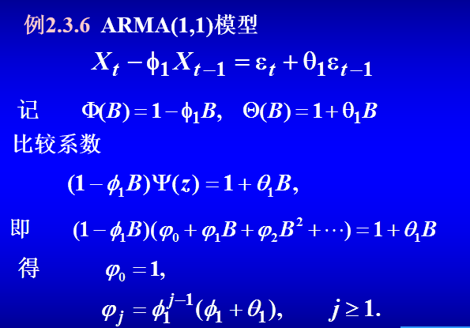

#### ARMA序列的可逆性

👉 若一个时间序列满足ARMA模型，则序列是**可逆ARMA序列**的充要条件是
$$
  滑动平均多项式的生成函数\Theta(z)的所有根都在单位圆外\\
  且沃尔德系数的生成函数的逆转形式\sum_{j=0}^{\infty} \pi_j z^j = \frac{\varPhi(z)}{\Theta(z)}
$$
滑动平均多项式系数满足的范围称为**可逆域**

可以根据👆得到沃尔德系数的生成函数逆转形式的递推形式

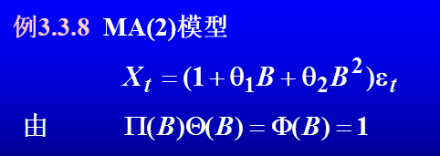

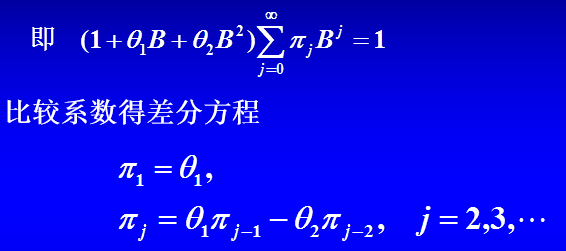

### 2.4 ARMA模型的平稳域和可逆域

👉 平稳域和因果域相同

👉 AR(2)的平稳域和因果域为
$$
  \varphi_2 - \varphi_1 <1 \\
  \varphi_2 + \varphi_1 <1 \\
  | \varphi_2 | <1 
$$

👉 MA(2)的可逆域为
$$
  \theta_1 +\theta_2 <1 \\
  \theta_1 - \theta_2 < 1 \\
  | \theta_2 | <1
$$
[来自blog](https://wenku.baidu.com/view/726d1719ba1aa8114431d9c8.html)

[推导见blog](https://wenku.baidu.com/view/6126f36f7e21af45b307a86c.html)

👉 JURY判别准则
$$
  对于ARMA模型\\
  若\varphi_1 < \varphi_2 < \cdots < \varphi_p < 0，则满足平稳性\\
  若\theta_1 < \theta_2 < \cdots < \theta_q < 0,则满足可逆性
$$

## Chapter 3 平稳序列的数字特征及其估计

### 3.1 平稳序列的均值及估计

#### 能否用一条现实求得$\,m_t\,$的良好估计

平稳的随机过程的均值具有**均方遍历性**时，可以用时间平均代替统计平均
$$
  \hat{m_t} = \overline{X_N} = \frac{1}{N}\sum_{t=1}^{N}X_t
$$

👉 若时间序列是严平稳的

👉 定理
$$
  若\varepsilon_t \sim WN(0,\sigma^2),实数列a_j平方可和，则线性平稳序列\\
  X_t = \sum_{j=0}^{\infty} a_j \varepsilon_{t-j}\\
  是严平稳遍历的
$$

$$
  若X_t是严平稳遍历序列，则对任意多元函数\phi(x_1,x_2,\cdots,x_m)\\
  Y_t = \phi(X_{t-1},X_{t-2},\cdots,X_{t-m})
   \quad i.e.这是传递形式\\
  是严平稳遍历序列
$$

$$
  若X_t是严平稳遍历序列，则X_tX_{t+k}也是严平稳遍历序列
$$

#### 估计量的统计性质

👉 无偏估计
$\,\overline{X_N}是m_X的无偏估计量\,$

👉 相合估计

$$1.\quad 若X_t是严平稳的遍历序列，且E(|X_t|) < \infty\\
则\overline{X_N}是m_X的强相合估计量(即依概率1收敛)$$

$$
2. ①\quad 若(宽)平稳序列的自协方差函数\gamma(N) \rightarrow 0(当N \rightarrow \infty时)\\
即平稳序列是均值遍历的，则方差\\
Var[\overline{X_N}] = E[\overline{X_N} - m_X]^2 \rightarrow 0\\
即\overline{X_N}是均方收敛于m_X,故依概率收敛于m_X\\
所以\overline{X_N}是m_X的(弱)相合估计量
$$

$$
  2.②若(宽)平稳序列的自协方差函数绝对可和\sum_{h=-\infty}^{\infty} | \gamma(h) | < \infty\\
  则 N \times Var[\overline{X_N}] \rightarrow \sum_{h=-\infty}^{\infty} | \gamma(h) |\\
  根据👆，利用中心极限定理，可以认为时间估计服从\\
  均值为m_X方差为\frac{\sum_{h=-\infty}^{\infty} | \gamma(h) |}{N}的正态分布\\
$$

由2.②可推得公式
$$
  \begin{aligned}
     N \times Var[\overline{X_N}] &= \sum_{|h|<N} (1-\frac{|h|}{N}) \gamma(h) \\
     &= \gamma(0) + 2\sum_{h=1}^{N-1} (1-\frac{|h|}{N}) \gamma(h)\\
     &=\gamma(0)[1+2\sum_{h=1}^{N-1} (1-\frac{|h|}{N}) \rho(h)]\quad i.e \,\rho(h)是自相关系数函数
  \end{aligned}
$$

#### 估计量的渐进分布

$$
  平稳线性序列X_t = m_X  + \sum_{k= -\infty}^{\infty} \varphi_j \varepsilon_{t-j} \\
  若\sum_{k=-\infty}^{\infty} |\varphi_j| < \infty,\sum_{k=-\infty}^{\infty} \varphi_j \neq 0\\
  则\overline{X_N}渐进服从正态分布N(m_X,\frac{\sum_{h=-\infty}^{\infty} | \gamma(h) |}{N})
$$
但存在问题，如何根据**一条现实**估计出**自协方差函数**

#### 样本长度

### 3.2 ARMA序列自协方差函数及计算

#### 自协方差函数回顾

👉 因为研究的一般是**零均值的时间序列**，所以对**自相关函数**和**自协方差函数**不作区分

👉 平稳序列自相关函数性质(回顾)

- 非负性 $\,\gamma(0) \geq 0\,$
- 有界性 $\,|\gamma(h)| \leq \gamma(0)\,$
- 对称性 $\,\gamma(h) = \gamma(-h)\,$
- 非负定性

#### ARMA(p,q)的自协方差函数

👉 回顾
$$
  Wold分解\quad 任意零均值纯平稳过程都可以表示为线性形式\\
  X_t = \sum_{j=0}^{\infty} \varphi_j \varepsilon_{t-j}\\
  其自相关函数为\\
  r(k) = \sigma_\varepsilon^2 \sum_{j=0}^{\infty} \varphi_j \varphi_{j+k}\\
  自相关系数函数为\\
  \rho(k) = \frac{\sum_{j=0}^{\infty} \varphi_j \varphi_{j+|h|}}{\sum_{j=0}^{\infty} \varphi_j^2}
$$
由于Wold系数在**平稳域**内是**负指数衰减**的，所以ARMA序列的自协方差函数在平稳域内也必定是负指数衰减的

👉 若一个随机序列的自协方差函数不是**负指数衰减**，可以判定它不适宜用ARMA模型描述

👉 计算

- 内积法

👉 引理
$$
    若ARMA序列有因果性,则\\
      \begin{aligned} 若s > t ,Cov(\varepsilon_sX_t)=E[\varepsilon_sX_t]&= E[\varepsilon_s \sum_{j=0}^{\infty} \varphi_j \varepsilon_{t-j}]\\
      &= \sum_{j=0}^{\infty} \varphi_j E[\varepsilon_s \varepsilon_{t-j}]\\
      & = 0
  \end{aligned}
$$
$$
\begin{aligned}
    若s\leq t,E[\varepsilon_sX_t] &= \sum_{j=0}^{\infty} E[\varepsilon_s \varepsilon_{t-j}] \\
    &= \varphi_{t-s} \sigma^2_\varepsilon
  \end{aligned}
$$
👉 定理

$对于因果ARMA(p,q)模型，序列的自协方差函数满足方程组$ 

👉 Ex

👉 ARMA自协方差函数具有**拖尾性**，即呈**负指数衰减**

- 递推法

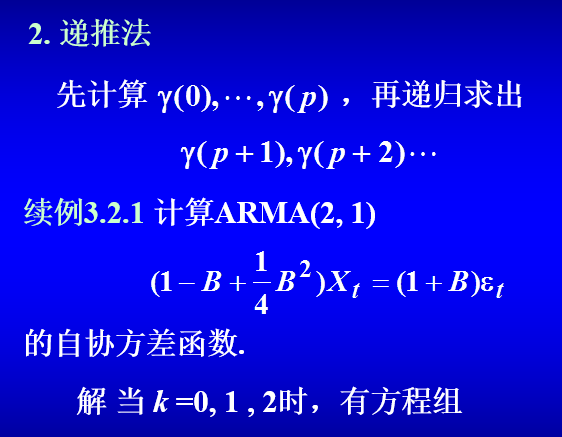

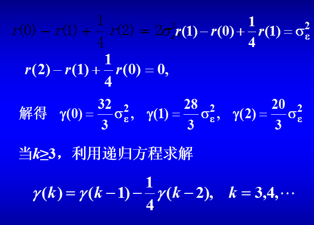

#### MA(q)的自协方差函数

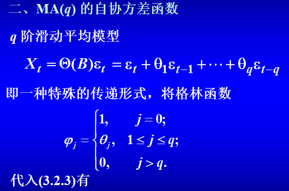

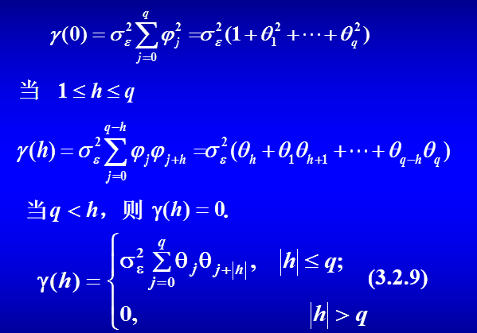

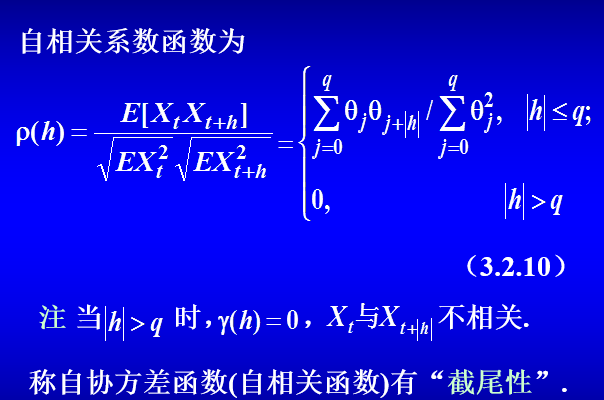

#### AR(p)的自协方差函数

👉 与ARMA(p,q)一样，具有**拖尾性**

#### 自协方差函数的允许域

👉 成为ARMA序列的自协方差函数需要满足

- 对称性
- 正定性
- 对应模型具有平稳性和可逆性

👉 **定义** ：使ARMA模型具有平稳可逆性的前**p+q+1**个自协方差函数所能取值的范围称为它们的**允许域**。

因为前p+q+1个自协方差函数能够解出$\,\varphi_1,\cdots,\varphi_p和\theta_1,\cdots,\theta_q,\sigma^2\,$,从而判断是否落在平稳域和可逆域

👉 Ex1

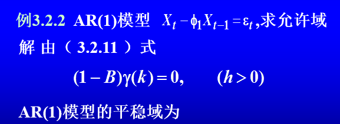

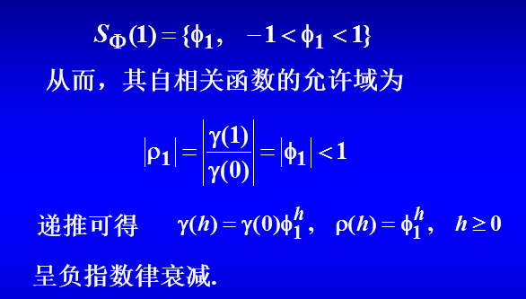

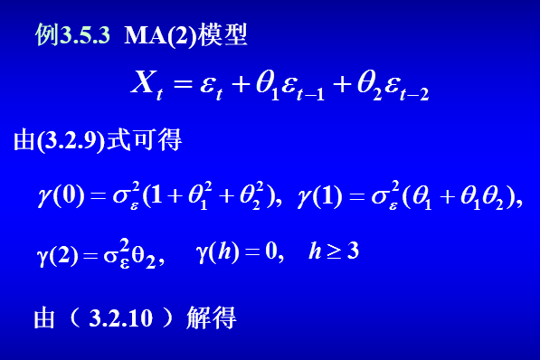

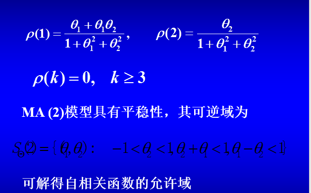

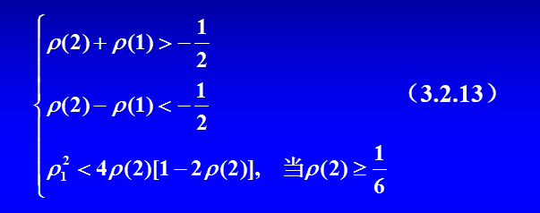

### 3.3 自协方差函数的估计

#### 自协方差函数估计量

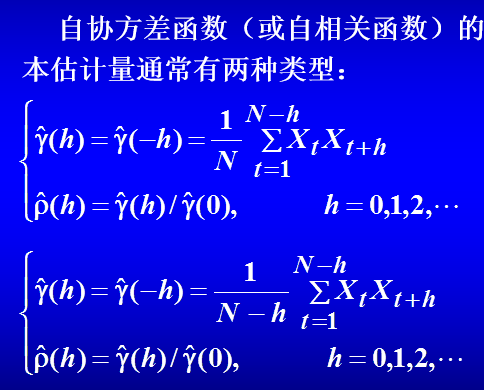

第一个是有偏估计量 第二个是无偏估计量

👉 如何确定样本长度N和h

$$
  Box-Jenkins准则 \quad 一般h = N/10
$$

👉 讨论两个估计量

为了能够套用**AR MA ARMA**模型，希望样本的自协方差函数以很快的速度衰减到0(因为MA模型是截尾的 AR和ARMA是拖尾的 但都可以认为收敛到0)

- 估计量2的优势是**无偏**
- 估计量1的优势是**收敛到0的速度更快**
- 但是对于较大的N和绝对值较小的h，两个的精度相差不大
- 更关键的是 **估计量1矩阵是正定的，估计量2矩阵不能保证正定性**(本质性质)

常选用**估计量1**，下面默认采用该估计量

#### 估计量的优良性

$$
  若X_t是平稳遍历随机序列\\
  估计量是相合估计量，即依概率收敛到\gamma(h)\\
  估计量是渐进无偏估计量\\
  若X_t是严平稳遍历随机序列，估计量是强相合估计量,即依概率1收敛到\gamma(h)
$$

#### 估计量的渐进分布(为啥会有重复标题2333)

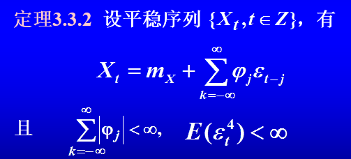

👉 Bartlett公式

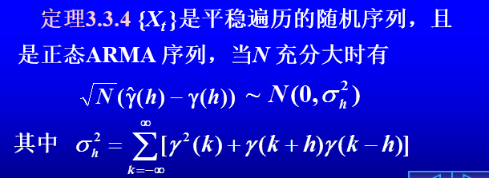

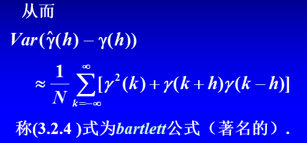

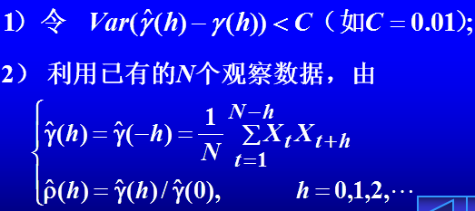

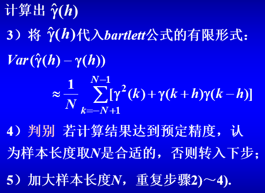

### 3.4 ARMA序列的偏相关函数

👉 由于MA模型的自相关函数是**截尾的**，所以很容易区分，但是AR和ARMA模型的自相关函数都是拖尾的，因此引入了偏相关函数来区分AR和ARMA

#### 偏相关函数定义

- 称$\,\hat{E} = [X_t | X_{t-1},\cdots,X_{t-k}] = \hat{=} \sum_{j=1}^{k} \phi_{kj}X_{t-j}\,$为$\,X_t\,$的**线性预报量**，称$\,\phi_{k1},\phi_{k2},\cdots,\phi_{kk}\,$为**预报系数**，$\,\phi_{kk}\,$是第k步**偏相关值**，序列$\,\{\phi_{kk}\}\,$为$\,X_t\,$的偏相关函数
- $\,X_{t-1},X_{t-2},\cdots,X_{t-k}\,$是关于$\,X_t\,$的**最小方差线性估计
- 序列$\,\phi_{kj}\,$标明了$\,X_{t-j}\,$对$\,X_t\,$的**线性贡献程度

#### 预报系数的直接算法

#### 预报系数的递推算法

👉 Yule-Walker线性方程组

👉 若用自相关函数表示 则为

👉 计算困难 有递推公式

👉 递推公式流程图

#### AR(p)序列偏相关函数的截尾性

- $\,平稳零均值序列为p阶自回归序列的充要条件是它的偏相关函数p步截尾\,$

#### MA，ARMA序列偏相关函数的拖尾性

- **可逆**的MA，ARMA序列偏相关函数满足$\,|\phi_{kk}| < g_1e^{-g_2k},g_1>0,g_2>0\,$，即具有拖尾性

#### 时间序列分类性质总结

#### 平稳时间序列的偏相关函数的估计

👉 思想：由样本自相关函数的估计求样本偏相关函数的估计

👉 将Yule-Walker线性方程组中的自相关函数换为估计量，有一样的递推公式

👉 对于平稳正态序列

- $\,\hat{\phi{kk}}\,$是$\,\phi_{kk}\,$的**渐近无偏估计量**和相合估计量
- $\,\hat{\phi{kk}}\,$渐近服从正态分布，且N足够大时，方差为1/N